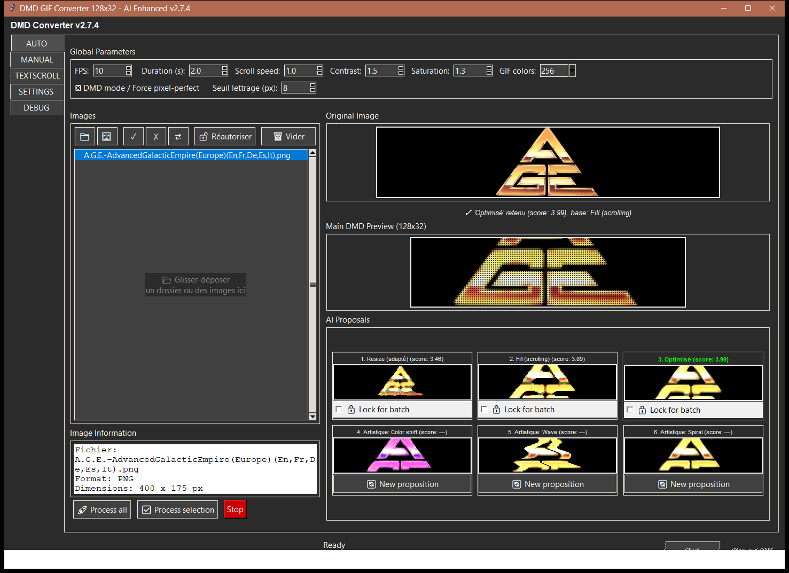
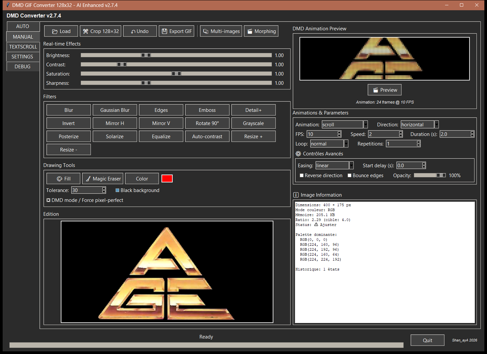
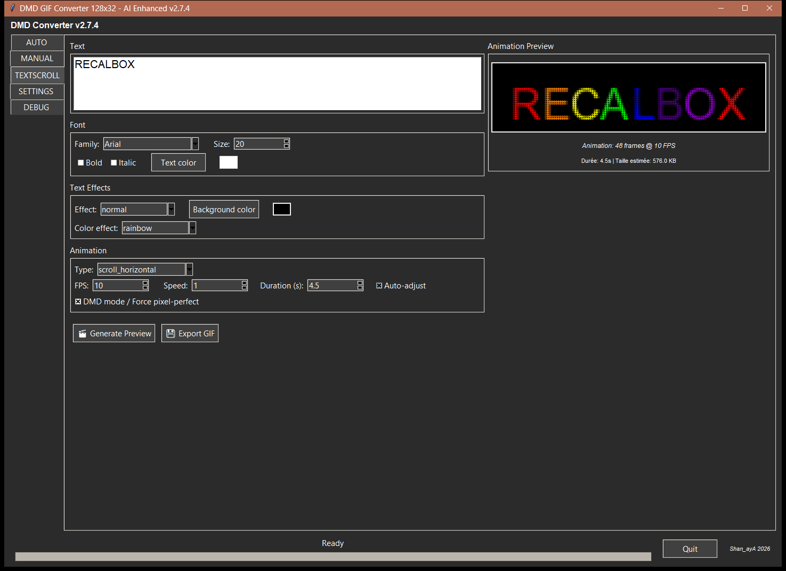
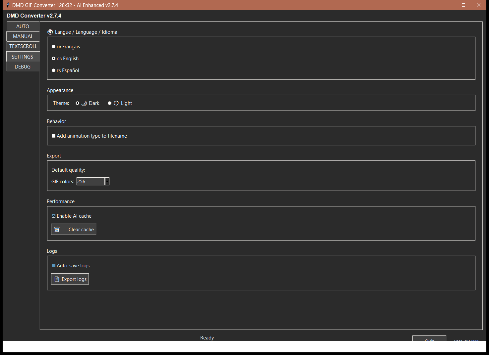
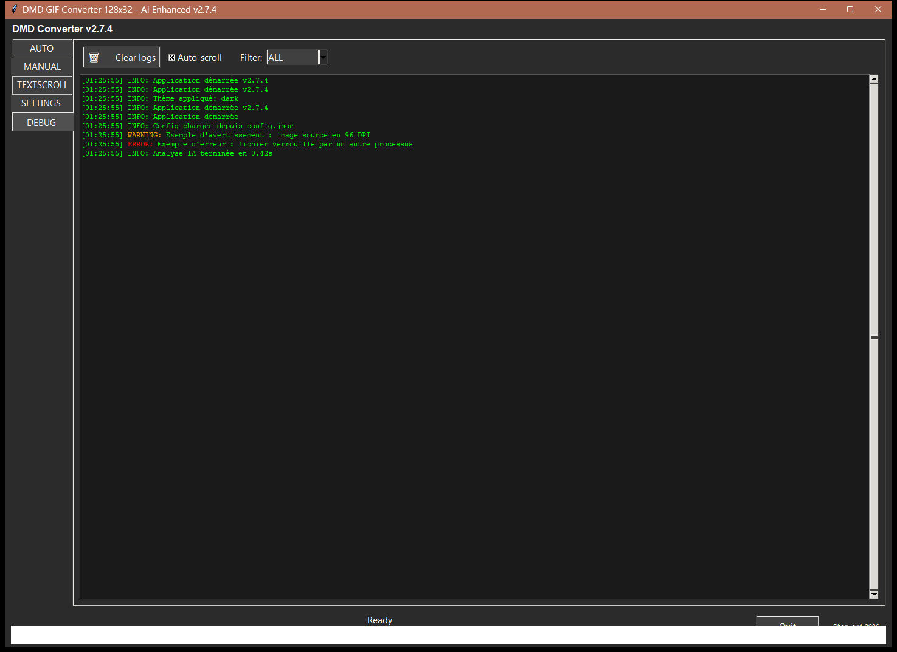

# DMD GIF Creator — User Guide

Python/Tkinter application that converts images, logos, and text into GIF animations
optimized for a 128×32 DMD display (arcade / pinball / RetroBox cabinet). This guide
describes, tab by tab, every function of the interface and how to use it.

> Guide up to date for version **3.0**. Screenshots were taken with version
> **2.7.4**, dark theme, interface set to English: the VIDEO and HELP tabs, added
> since, are not shown.
>
> **Localization note:** a few labels and information panels (for example the field
> names of the "Image Information" and "Source Video" panels, such as `Fichier:` or
> `Résolution:`) can still appear in French whatever the selected language, as can
> the messages of the DEBUG tab. The screenshots below, taken with an older version,
> show some French words for the same reason.

---

## Menu

1. [Overview](#overview)
2. [AUTO tab — AI analysis and proposals](#auto-tab--ai-analysis-and-proposals)
3. [MANUAL tab — advanced editing](#manual-tab--advanced-editing)
4. [VIDEO tab — GIF from a video](#video-tab--gif-from-a-video)
5. [TEXTSCROLL tab — animated text](#textscroll-tab--animated-text)
6. [SETTINGS tab](#settings-tab)
7. [DEBUG tab](#debug-tab)
8. [HELP tab](#help-tab)
9. [Cross-cutting feature: DMD mode / Force pixel-perfect](#cross-cutting-feature-dmd-mode--force-pixel-perfect)
10. [Best practices and known limitations](#best-practices-and-known-limitations)

---

## Overview

On launch, the application shows a column of tabs on the left:

**AUTO** · **MANUAL** · **VIDEO** · **TEXTSCROLL** · **SETTINGS** · **DEBUG** · **HELP**

Each tab corresponds to a different way of producing a 128×32 GIF animation:

| Tab | Purpose |
|---|---|
| AUTO | Load one or several images (logos, artwork...), the AI analyzes each one and proposes 6 ready-to-use renders. The fastest way to process a batch of images. |
| MANUAL | Load an image and adjust every parameter yourself (effects, animation, drawing) — full control, no automation. |
| VIDEO | Load a video, choose the section and the framing (automatic tracking or by hand), and get a 128×32 GIF. |
| TEXTSCROLL | Type text and pick a font/effect/animation — no source image needed. |
| SETTINGS | Language, theme, export and performance settings for the application. |
| DEBUG | Application activity log, useful for diagnosing an issue. |
| HELP | This guide, in the interface language. |

Hovering over a non-obvious setting (pixel-perfect, lettering threshold, tolerance,
easing, video framing modes...) shows a **help tooltip** in the interface language.

---

## AUTO tab — AI analysis and proposals

This is the most complete tab: bulk loading, automatic readability/coverage
analysis, and 6 render proposals generated per image.

### 1. Global Parameters (top bar)

These settings apply to **every** proposal and to batch processing:

- **FPS**: frames per second of the generated animation (1 to 60).
- **Duration (s)**: target animation duration in seconds.
- **Scroll speed**: scrolling speed in Fill/scroll mode (0.1 to 10, allows slower
  scrolling than 1 pixel/frame).
- **Contrast** / **Saturation**: intensity applied by the DMD optimization engine
  (`optimize_for_dmd`) before rendering — an internal safeguard prevents these
  settings from "blowing out" already-bright pixels to pure white.
- **GIF colors**: final quantization palette (8 to 256 colors).
- **DMD mode / Force pixel-perfect**: see the
  [dedicated section](#cross-cutting-feature-dmd-mode--force-pixel-perfect) below —
  this checkbox is **shared with the MANUAL and TEXTSCROLL tabs** (checking it here
  checks it everywhere).
- **Seuil lettrage (px)** (6 to 11, default 8, label not yet translated): minimum
  letter height (in pixels, after scaling) required to be judged legible. Below that,
  the engine automatically switches the "Optimisé" proposal to Fill/scroll mode
  instead of a Resize that would make the text unreadable.

Changing any of these settings automatically re-triggers analysis of the currently
selected image.

### 2. "Images" panel (left column)

- **📁**: adds an entire folder (always scanned recursively — a folder containing
  only subfolders is therefore correctly picked up).
- **🖼️**: adds one or several individual image files.
- **Drag & drop**: works anywhere in the window (folder or files).
- **✓ / ✗ / ⇄**: select all / deselect all / invert selection in the list.
- **🔓 Réautoriser** ("Re-authorize"): re-authorizes an image previously marked as
  already exported (see below).
- **🗑 Vider** ("Clear"): empties the list entirely.
- Accepted formats: **PNG, JPG, BMP, GIF and raw565** (the raw RGB565 format read
  by the DMD — handy to rework images that are already converted).
- **Large folders**: the scan runs in the background and the window stays usable;
  the title bar shows "Searching images… n" until it is done. Tens of thousands of images load in a few seconds.
- Every addition is **additive** (does not overwrite the existing list) and
  deduplicated.
- Right-click on an image, or the `Delete` key: removes the selected image from the
  list (context menu "🗑 Retirer de la liste").
- Clicking an image in the list triggers its analysis and shows its preview.

### 3. "Image Information" panel

Shows, for the selected image: file name, format, dimensions, color mode, file size,
detected dominant palette, and width/height ratio compared to the DMD target (4.0 =
128/32). Field labels in this panel are currently only available in French
(`Fichier:`, `Format:`, `Dimensions:`...).

### 4. Central previews

- **Original Image**: the source image as-is (black background guaranteed even on a
  transparent PNG).
- **Main DMD Preview (128×32)**: the render of the currently selected proposal,
  enlarged on screen. Continuously animated (scroll, effects...). If "DMD mode /
  Force pixel-perfect" is checked, every frame is simulated in physical LED style
  (round dots with glow) instead of a simple square upscale.
- Below the original preview, a status message shows which proposal was
  automatically retained and why (e.g. "'Optimisé' retenu (score: 3.99), base: Fill
  (scrolling)", or "texte illisible en Resize → Fill forcé" when the letter-height
  threshold triggered a forced switch — this status line is not yet localized).

### 5. AI Proposals (3×2 grid)

For each image, 6 renders are computed and shown as thumbnails:

| # | Name | Principle |
|---|---|---|
| 1 | Resize (adapté) | The whole image is scaled to fit inside 128×32 without cropping (letterboxing). |
| 2 | Fill (scrolling) | The image fills the entire 32px height, usually wider than 128px → scrolls horizontally. |
| 3 | Optimisé | The best of the two above (highest score), with cleanup and pixel-perfect tested and kept only if they improve the render. This is the proposal used by default for batch processing. |
| 4-6 | Artistique 1-3 | A MANUAL-tab effect (color_shift, wave, spiral, fade, pulse, zoom...) applied on top of proposal 3's animation, chosen based on the image's characteristics (edge density, colorfulness). |

- **Clicking a thumbnail** selects that proposal for the main preview and for export.
- Hovering a thumbnail shows a tooltip with the exact settings used.
- **Proposals 1-3**: "🔒 Verrouiller pour le batch" ("Lock for batch") checkbox —
  forces this specific proposal (instead of the automatic best score) for **every**
  image processed in the next batch run. Only one proposal can be locked at a time.
- **Proposals 4-6**: "🔄 New proposition" button — rolls a new random artistic effect
  (different from the previous one) for that slot.

### 6. Batch processing

- **🚀 Traiter tout** ("Process all"): exports a GIF for every image in the list.
- **✅ Traiter sélection** ("Process selection"): exports only the images selected in
  the list.
- **⛔ Interrompre** ("Stop"): cancels an ongoing batch.
- An output folder is requested on first run; the relative folder structure of the
  source images (relative to the loaded folder) is recreated inside the output
  folder. When done, a message offers to open the output folder directly.
- Images are processed **in parallel**, using almost all CPU cores (up to 12 images
  at a time): a batch finishes much faster than one image at a time.

---

## MANUAL tab — advanced editing

Full control, with no readability automation whatsoever: you choose every effect and
every animation parameter yourself.

### 1. Toolbar (top)

- **📂 Load**: loads an image from disk.
- **✂️ Crop 128×32**: activates a manual cropping mode at the target size.
- **↶ Undo** / **↷ Redo**: incremental undo/redo history. Every filter, fill,
  magic eraser, or crop is a history checkpoint; undoing then redoing recovers
  the exact intermediate states (not just the start/end). Performing a new
  action after an undo clears the following "redo" branch, same as in any
  standard editor. The 4 real-time effect sliders (next section) do not create
  history checkpoints (continuous adjustment, not a one-off action).
- **💾 Export GIF**: exports the currently generated animation.
- **📚 Multi-images**: loads several images for morphing (reveals the "Images
  chargées (morphing)" list right below).
- **🎬 Morphing**: generates a cross-fade transition animation between the loaded
  multi-images.

### 2. Real-time Effects

4 sliders applied **immediately** to the displayed image (a mechanism entirely
separate from AUTO's optimization engine — no automatic highlight-clipping
protection is applied here, control is intentionally left entirely to the user):

- **Brightness** (0.5–2.0), **Contrast** (0.5–3.0), **Saturation** (0.0–2.0),
  **Sharpness** (0.0–3.0).

### 3. Filters

Immediate, cumulative-effect buttons: Blur, Gaussian Blur, Edges, Emboss, Detail+,
Invert, Mirror H, Mirror V, Rotate 90°, Grayscale, Posterize, Solarize, Equalize,
Auto-contrast, Resize + / Resize -.

### 4. Drawing Tools

- **🎨 Fill**: paint-bucket mode (clicking the image fills the contiguous
  color-matching area with the chosen color, based on the **Tolerance** setting).
- **🧹 Magic Eraser**: erases (makes transparent/black) an area of similar color on
  click, using the same tolerance logic.
- **Color**: picks the active color used for the fill tool (preview shown next to the
  button).
- **Tolerance**: color-matching sensitivity for fill/eraser (0–100).
- **Black background**: indicator checkbox tied to background rendering.
- **DMD mode / Force pixel-perfect**: checkbox shared with AUTO and TEXTSCROLL, see
  the [dedicated section](#cross-cutting-feature-dmd-mode--force-pixel-perfect).

### 5. Edition (canvas)

Main canvas (640×480) showing the image being edited — this is where drawing-tool
clicks are applied.

### 6. DMD Animation Preview (right column)

- 512×128 canvas showing the animation looping. If "DMD mode / Force pixel-perfect"
  is checked, rendered in simulated LED style (same as AUTO); otherwise a classic
  square-upscaled render.
- **🎬 Preview**: (re)generates the animation from the current settings.

### 7. Animations & Parameters

- **Animation**: 18 available types (scroll, fade_in/out, zoom_in/out, rotate, wave,
  bounce, flash, slide_left/right, spiral, shake, pulse, glitch, pixelate,
  blur_transition, color_shift).
- **Direction**: horizontal / vertical (relevant for scroll-type animations).
- **FPS**, **Speed**, **Duration (s)**: same principles as in AUTO but with settings
  specific to the MANUAL tab (not shared).
- **Loop**: normal / ping-pong / infinite, with a **Repetitions** count.
- **⚙️ Advanced Controls**: applied as post-processing on the already-generated
  frames, regardless of the chosen animation type.
  - **Easing** (linear/ease-in/ease-out/ease-in-out/bounce): changes the relative
    playback speed over the course of the animation (speeds up/slows down the
    start or end) without changing the frame count or total duration.
  - **Start delay (s)**: adds static frames (frozen starting image) at the very
    beginning of the animation, once (not repeated on every loop).
  - **Reverse direction**: plays the frame sequence in reverse order.
  - **Bounce edges**: the sequence goes back and forth instead of stopping or
    looping abruptly at the end, within the same total duration.
  - **Opacity**: global fade of the animation toward black, applied last.

### 8. Image Information

Same information as in AUTO (dimensions, color mode, memory, ratio, dominant
palette), plus the number of states in the undo history. Field labels here are also
currently only available in French.

---

## VIDEO tab — GIF from a video

Turns a section of a video (MP4, AVI, MOV, MKV) into a 128×32 GIF. Requires the
`opencv-contrib-python` module (included in the Windows executable); if it is
missing, the tab says so.

### 1. Load and play

- **📹 Load Video**: opens a video file. You can also **drag and drop** a video
  anywhere on the window, whatever tab is shown.
- **Playback**: the video loops as a thumbnail. **Click it** to open it full size in
  the Windows video player.
- **ℹ️ Source Video**: file name, resolution, duration, frames per second, total
  number of frames and file size.

### 2. Video GIF Settings

- **FPS** (1 to 60): initially set to the video's own frame rate.
- **Duration (s)**: length of the GIF; by default, the length of the selection.
- **GIF Colors**: 8 to 256.
- **DMD mode / Force pixel-perfect**: the same checkbox as in the other tabs.
- **🪄 Auto quality**: adjusts contrast, saturation and brightness from a few
  frames of the video before the DMD render.
- **Loop** (normal / ping-pong / infinite) and **Repetitions**.
- **ℹ️ GIF to export** and **Estimated GIF size**: summary updated live.

### 3. Selection (trim)

A strip of thumbnails shows the video. The **green handle** (start) and the **red
handle** (end) delimit the part that is kept: drag them to move them — a plain click
elsewhere does not move them. The selected duration is shown above the strip.

The **cyan line** (with its triangle) is the **framing time**: move it to browse the
video and see or edit the framing at that moment, without changing the selection.

### 4. Region of interest (video framing)

A video is rarely 128×32: you choose which part of the picture to keep.
**Framing mode** — three modes, only one active at a time:

| Mode | How it works |
|---|---|
| 🎯 **Auto-tracking** | Draw a rectangle once on the subject; a tracker (OpenCV) follows it throughout the video. Frame size computed automatically. |
| 🪄 **Auto framing (zoom)** | You place the frame yourself (drag the rectangle); its size is computed automatically. No tracking, a single framing. |
| ✋ **Manual** | No automation: you set points in time, each with its own area and zoom. |

In **✋ Manual** mode:

- **➕ Point here**: draw a rectangle on the wanted area; when you release it, it
  becomes an area point at the current framing time (it replaces a point that is
  already very close). Drag the inside of the rectangle to move it, with a live
  preview.
- **🔍 Zoom here**: sets a zoom point at the current time, using the **Framing zoom**
  slider value (-100% = whole picture resized, 0 = tight crop, +100% = zoom). Between
  two points, area and zoom change progressively.
- **🗑️ Delete this point**: deletes the point closest to the current time;
  **🗑️ Clear points** deletes them all; **🔄 Recenter** recenters the frame.
- **↶ Undo** / **↷ Redo**: undoes or redoes the last action on the points;
  **📜 Framing history** lists these actions.
- **Points timeline** (under the strip): orange disc = auto-tracking point,
  purple square = manual point, teal diamond = zoom point. Drag a point to move it in
  time.

**Framing preview** shows live the part of the picture that will be kept.

### 5. Generate and export

- **🎬 Generate Preview**: computes the GIF (framing, quality, DMD render) and plays
  it in **Animation Preview (Video)** — in DMD mode, with the 🔍 magnifier and the
  💡 LED brightness slider, as in the other tabs.
- **💾 Export GIF**: saves the GIF.

---

## TEXTSCROLL tab — animated text

Generates an animation directly from typed text, with no source image needed.

### 1. Text

Multi-line input box; the typed text is rendered directly as a DMD image (no file
loading, so no transparency/PNG concerns here).

### 2. Font

- **Family**: list of available system fonts.
- **Size**: 8 to 48 px.
- **Bold** / **Italic**.
- **Text color**: color picker (preview shown next to it).

### 3. Text Effects

- **Effect**: normal, 3d, fire, snow, ice, metal, neon, graffiti, pixel_art, outline,
  shadow.
- **Background color**: background color of the text render.
- **Color effect** (only active with the "normal" effect): none, rainbow, matrix,
  fire, gradient.

### 4. Animation

- **Type**: scroll_horizontal, scroll_vertical, scroll_wave, starwars,
  bounce_scroll, typewriter, explode, matrix_rain, spiral, shake, glitch, fade_in,
  static.
- **FPS**, **Speed**, **Duration (s)** (auto-extended for long text).
- **Auto-adjust**: automatically extends the duration for text longer than 50
  characters.
- **DMD mode / Force pixel-perfect**: checkbox shared with AUTO and MANUAL — switches
  the preview to simulated LED rendering (see the
  [dedicated section](#cross-cutting-feature-dmd-mode--force-pixel-perfect)).

### 5. Actions

- **🎬 Generate Preview**: computes the animation and shows it in the "Animation
  Preview" frame (frame count, FPS, and estimated GIF size are shown under the
  canvas — this info line is not yet localized, it stays in French: "Durée: 4.5s |
  Taille estimée: 576.0 KB").
- **💾 Export GIF**: exports the generated animation.

---

## SETTINGS tab

Global application settings (not tied to any particular image or project):

- **🌍 Language**: Français / English / Español — requires an application restart to
  fully take effect.
- **Appearance**: Dark or Light theme (applied immediately).
- **Behavior**: "Add animation type to filename" checkbox for exports.
- **Export**: default GIF color count (8 to 256).
- **Performance**: "Enable AI cache" checkbox and "🗑️ Clear cache" button.
- **Logs**: "Auto-save logs" checkbox and "📄 Export logs" button (writes the
  activity log to a file).

---

## DEBUG tab

Real-time application activity log — useful for diagnosing an error or understanding
what the AI is doing behind the scenes.

- **🗑️ Clear logs**: clears the display (and the internal log history).
- **Auto-scroll**: keeps the latest line always visible.
- **Filter**: ALL / INFO / WARNING / ERROR / DEBUG — only shows entries of the
  selected level.
- Each line is timestamped and colored by level (green = INFO, orange = WARNING, red
  = ERROR, blue = DEBUG). Note: the log **messages themselves** are written in French
  in the application's source code and are not translated by the language setting —
  you will see French text in this panel regardless of the selected UI language.

---

## HELP tab

Shows this guide in the language chosen in SETTINGS (French, English or Spanish), in
the colors of the theme. The menu at the top of the guide is clickable.
**🌐 Open in browser** opens the guide file with the program associated with `.md`
files on your PC.

---

## Cross-cutting feature: DMD mode / Force pixel-perfect

This checkbox exists in all **four** generation tabs (AUTO, MANUAL, VIDEO,
TEXTSCROLL) and points to **the same underlying variable**: checking it in one tab automatically
checks it in the others.

It has two combined effects:

1. **Scaling**: enforces an exact integer scale factor instead of a fractional-scale
   resize, for perfect pixel alignment on the DMD grid.
2. **Preview rendering**: in all 4 animated preview canvases, every frame is
   simulated in physical LED style (round dots separated by a dark bezel, with a
   slight glow) instead of a simple square upscale — to visualize on screen a render
   close to what the actual cabinet display will show. When unchecked, the preview
   reverts to the classic (crisp, square-upscaled) render.

Two extras available in the same 4 tabs, only while the checkbox is checked:

- **🔍 Magnifier on hover**: hovering the preview canvas reveals a magnifying-glass
  icon in the top-right corner. Clicking it opens a separate window with the
  enlarged LED render, animated live in sync with the normal preview.
- **💡 LED brightness**: vertical slider next to the canvas (0-100%, default 50%).
  Simulates a physical LED panel's brightness setting: brighter pushes colors
  toward white and increases the glow bloom (a brighter LED "bleeds" more onto its
  neighbors); dimmer darkens and reduces the glow. 50% is the default neutral
  render.

---

## Best practices and known limitations

- **Transparent-background images (RGBA PNG)**: handled correctly everywhere (the
  transparent background is always composited onto black, never left as-is) —
  avoids white/colored halos around cut-out logos.
- **MANUAL tab, real-time sliders**: no protection against highlight clipping
  (unlike AUTO) — at high contrast/saturation values, bright pixels can be "blown
  out" to pure white; this is an intentional choice to leave full control to the
  user.
- **Letter-height threshold** (AUTO): a lower setting (6) tolerates smaller letters
  before forcing Fill mode; a higher setting (11) is more cautious and forces Fill
  more often. The default (8) is a compromise validated against a corpus of real
  logos.
- **Partial localization**: as noted at the top of this guide, several UI strings
  (drag-and-drop hint, some button labels, the Image Information panel content, the
  TEXTSCROLL size-estimate line, some proposal-caption words, and every internal log
  message) remain hardcoded in French regardless of the selected language. This is a
  tracked, known limitation — not a bug in this translated guide.
