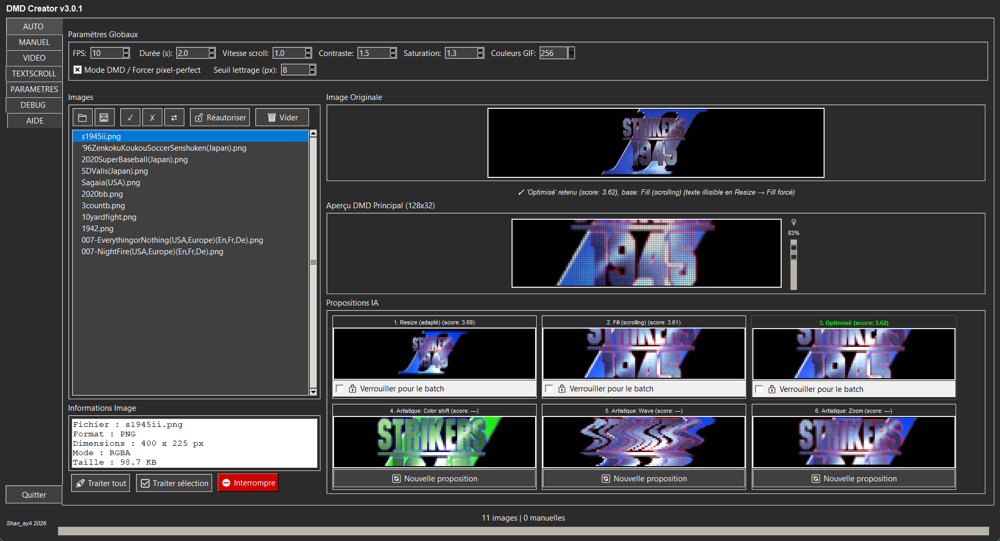
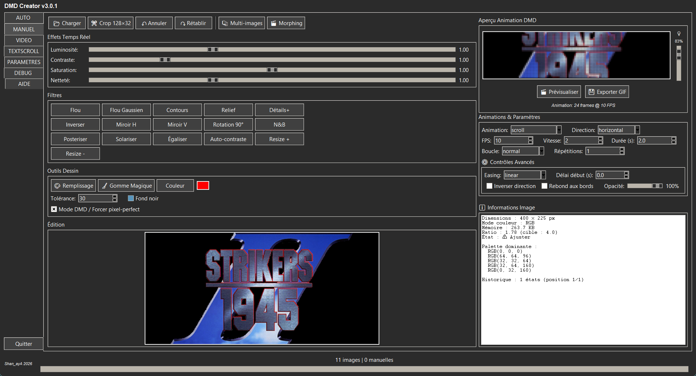
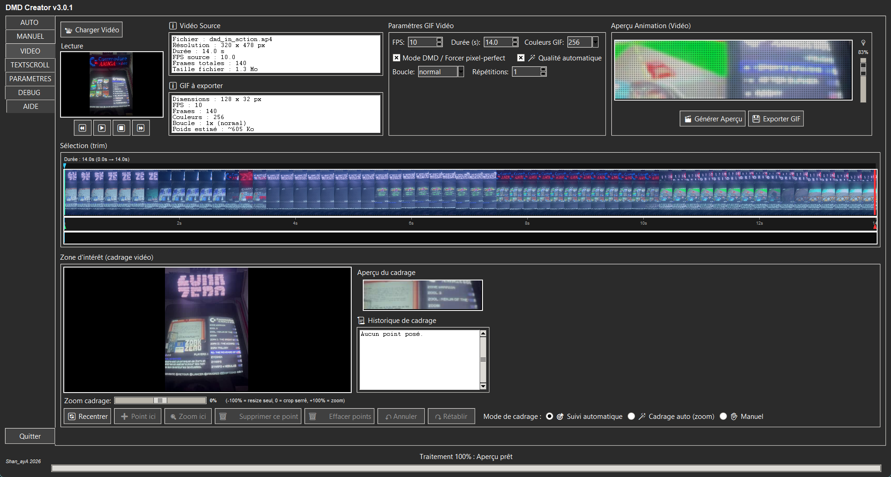
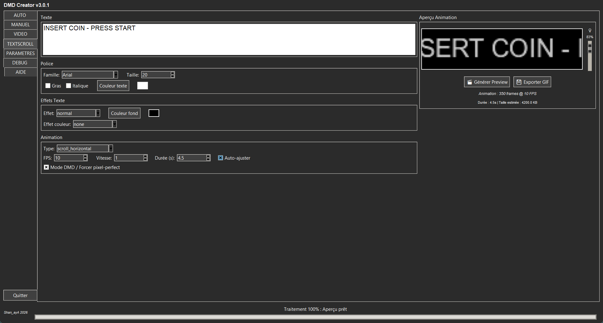

🇫🇷 **Français** · [🇬🇧 English](./README_EN.md) · [🇪🇸 Español](./README_ES.md)

# DMD GIF Creator 128x32 — v3.0.1

Créez des GIF optimisés pour les écrans DMD 128×32 (borne d'arcade, flipper,
[RecalBox DMD](https://github.com/shan-aya/RecalBoxDMD)) à partir d'**images**, d'une
**vidéo** ou de **texte animé**, avec analyse automatique, édition manuelle avancée et
traitement par lot de dossiers entiers.

(Anciennement « DMD GIF Converter ».)

## Téléchargement

**Windows** : téléchargez `dmd_gif_creator_v301.exe` dans la
[dernière Release](https://github.com/shan-aya/DMD_GIF_converter/releases/latest) et
lancez-le — aucune installation nécessaire.

**Depuis les sources** (dossier [`dmd_gif_creator/`](./dmd_gif_creator)) :

    pip install pillow numpy tkinterdnd2 markdown opencv-contrib-python
    python dmd_gif_creator/dmd_gif_creator_v301.py

`opencv-contrib-python` (et non `opencv-python`) est nécessaire pour le suivi
automatique de l'onglet VIDEO ; les deux paquets ne doivent pas être installés en même
temps.

## Ce que fait l'application

### AUTO — une image, six propositions

Glissez-déposez des images ou des dossiers entiers (PNG, JPG, BMP, GIF, raw565).
Pour chaque image, l'application analyse le contenu et propose six rendus 128×32 :
redimensionné, défilant, optimisé, et trois variantes artistiques. L'aperçu LED
reproduit le rendu réel du panneau. Le **traitement par lot** convertit ensuite toute
la liste en parallèle, en conservant l'arborescence des dossiers, sans jamais modifier
les fichiers source.

### MANUEL — édition avancée

Recadrage 128×32, luminosité, contraste, saturation, netteté, filtres, pot de peinture
et gomme magique, animations (défilement, zoom, fondu…) avec easing et boucle,
multi-images et morphing, historique annuler/rétablir.

### VIDEO — un GIF à partir d'une vidéo

Choisissez un passage d'une vidéo (MP4, AVI, MOV, MKV) sur la frise, puis le cadrage :
suivi automatique d'un sujet, cadrage auto avec zoom, ou points manuels (zone et zoom
qui évoluent dans le temps). La qualité automatique ajuste contraste, saturation et
luminosité d'après la vidéo, et le poids du GIF est estimé en direct.

### TEXTSCROLL — texte animé

Police, taille, couleurs, effets de texte et de couleur, et de nombreuses animations
(défilement horizontal ou vertical, vague, Star Wars, machine à écrire, pluie Matrix,
glitch…), avec une durée ajustée automatiquement à la longueur du texte.

### Et aussi

- **PARAMETRES** : réglages par défaut, langue (français, anglais, espagnol).
- **DEBUG** : journal détaillé filtrable.
- **AIDE** : le guide complet dans l'application.

## Nouveautés

**v3.0.1**
- Traitement par lot environ **2,4 fois plus rapide** : jusqu'à 12 images en parallèle
  selon le processeur, et encodage GIF accéléré.
- Interface traduite plus complètement en anglais et en espagnol.

**v3.0**
- Onglet **VIDEO**, onglet **AIDE**, **glisser-déposer** partout dans la fenêtre.
- **Aperçu LED** dans tous les onglets de création.
- Traitement par lot en parallèle, chargement de dossiers de dizaines de milliers
  d'images sans figer la fenêtre.
- Format raw565 en entrée, annuler/rétablir dans MANUEL, infobulles d'aide.

Historique complet : [CHANGELOG_FR](./CHANGELOG_FR)

## Documentation

Notice complète : [🇫🇷 Français](./NOTICE_FR.md) · [🇬🇧 English](./NOTICE_EN.md) ·
[🇪🇸 Español](./NOTICE_ES.md) — également disponible dans l'application, onglet
**AIDE**.

---

## 🤝 Remerciements

- [RetroPixelLED original](https://github.com/fjgordillo86/RetroPixelLED)
- Visual Studio Code
- [Sixth](https://trysixth.com/)

## ☕ Soutenir le projet

Si ce projet t'a aidé, tu peux m'offrir un café :
👉 [☕ Donate via PayPal](https://www.paypal.com/paypalme/felysaya)

## Contact

Pour toute question, suggestion ou contribution, créez une issue ou contactez l'auteur
Shan_ayA.

---

© 2026 Shan_ayA
