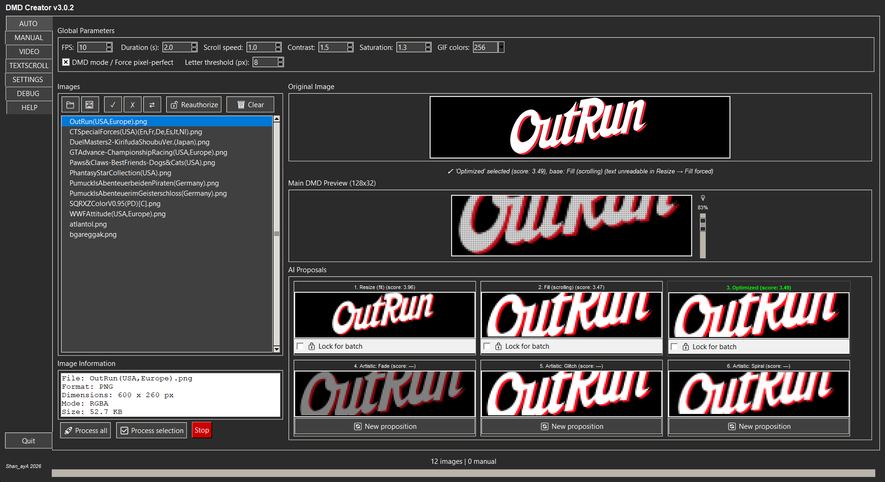
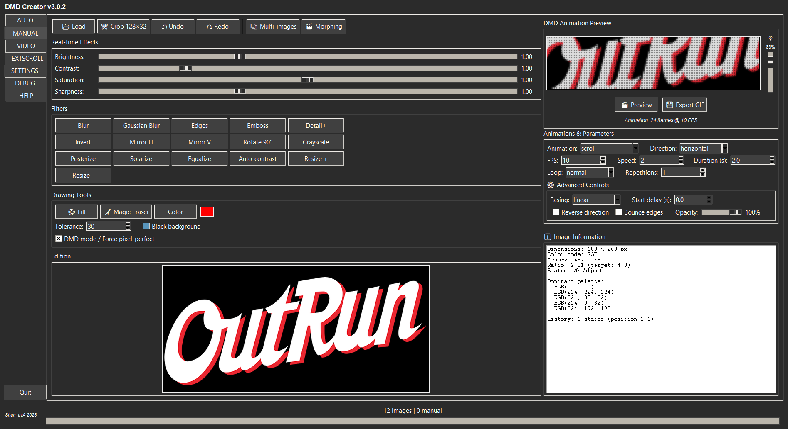
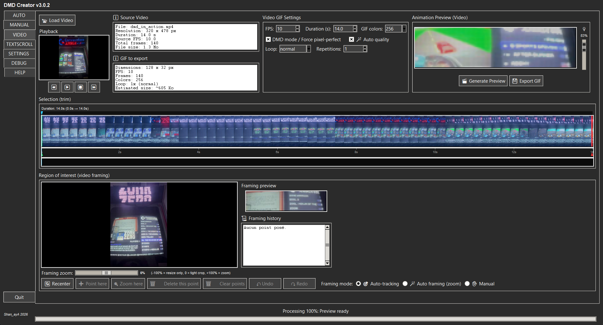
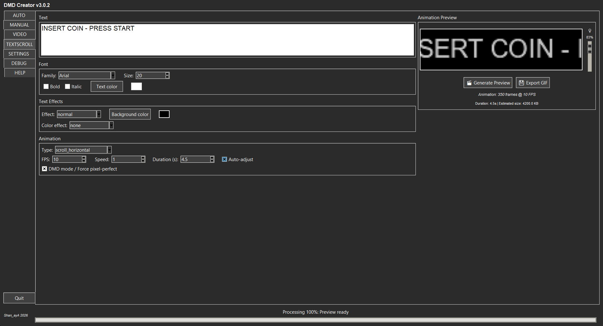

[🇫🇷 Français](./README.md) · 🇬🇧 **English** · [🇪🇸 Español](./README_ES.md)

# DMD GIF Creator 128x32 — v3.0.2

Create GIFs optimized for 128×32 DMD displays (arcade cabinet, pinball,
[RecalBox DMD](https://github.com/shan-aya/RecalBoxDMD)) from **images**, a **video**
or **animated text**, with automatic analysis, advanced manual editing and batch
processing of whole folders.

(Formerly "DMD GIF Converter".)

## Download

**Windows**: download `dmd_gif_creator_v302.exe` from the
[latest Release](https://github.com/shan-aya/DMD_GIF_converter/releases/latest) and run
it — nothing to install.

**From the sources** ([`dmd_gif_creator/`](./dmd_gif_creator) folder):

    pip install pillow numpy tkinterdnd2 markdown opencv-contrib-python
    python dmd_gif_creator/dmd_gif_creator_v302.py

`opencv-contrib-python` (not `opencv-python`) is required for the automatic tracking of
the VIDEO tab; the two packages must not be installed at the same time.

## What the application does

### AUTO — one image, six proposals

Drag and drop images or whole folders (PNG, JPG, BMP, GIF, raw565). For each image,
the application computes two 128×32 renders — **Resize** (the whole image scaled down)
and **Fill** (the image at a larger size, scrolling) — and scores them on screen
coverage and readability. The best one is kept, then refined (cleanup,
pixel-perfect). **If the text gets too small to read in Resize, Fill is enforced**,
even when Resize has the better score. Three artistic variants complete the six
proposals; the LED preview (with magnifier) shows the real panel render.

**Batch processing** applies the same analysis to every image of a folder — all the
scraped logos of a game library, for example: each logo gets the render mode that
suits it, in parallel, with the folder tree kept and source files never modified. A
proposal can be locked for the whole batch.

### MANUAL — advanced editing

128×32 crop, brightness, contrast, saturation, sharpness, filters, fill and magic
eraser, animations (scroll, zoom, fade…) with easing and looping, multi-images and
morphing, undo/redo history.

### VIDEO — a GIF from a video

Pick a section of a video (MP4, AVI, MOV, MKV) on the timeline, then the framing:
automatic subject tracking, auto framing with zoom, or manual points (area and zoom
that change over time). Automatic quality adjusts contrast, saturation and brightness
from the video, and the GIF size is estimated live.

### TEXTSCROLL — animated text

Font, size, colors, text and color effects, and many animations (horizontal or
vertical scroll, wave, Star Wars, typewriter, Matrix rain, glitch…), with a duration
fitted automatically to the text length.

### Also

- **SETTINGS**: defaults, language (French, English, Spanish).
- **DEBUG**: detailed, filterable log.
- **HELP**: the full guide inside the application.

## What's new

**v3.0.2**
- AUTO tab fully translated into English and Spanish (proposal names, status line,
  status bar).

**v3.0.1**
- Batch processing about **2.4 times faster**: up to 12 images in parallel depending
  on the CPU, and faster GIF encoding.
- More complete English and Spanish translation of the interface.

**v3.0**
- **VIDEO** tab, **HELP** tab, **drag and drop** anywhere on the window.
- **LED preview** in every creation tab.
- Parallel batch processing, folders of tens of thousands of images loaded without
  freezing the window.
- raw565 input format, undo/redo in MANUAL, help tooltips.

Full history (in French): [CHANGELOG_FR](./CHANGELOG_FR)

## Documentation

Full user guide: [🇫🇷 Français](./NOTICE_FR.md) · [🇬🇧 English](./NOTICE_EN.md) ·
[🇪🇸 Español](./NOTICE_ES.md) — also available inside the application, **HELP** tab.

---

## 🤝 Thanks

- [RetroPixelLED original](https://github.com/fjgordillo86/RetroPixelLED)
- Visual Studio Code
- [Sixth](https://trysixth.com/)

## ☕ Support the project

If this project helped you, you can buy me a coffee:
👉 [☕ Donate via PayPal](https://www.paypal.com/paypalme/felysaya)

## Contact

For any question, suggestion or contribution, open an issue or contact the author
Shan_ayA.

---

© 2026 Shan_ayA
