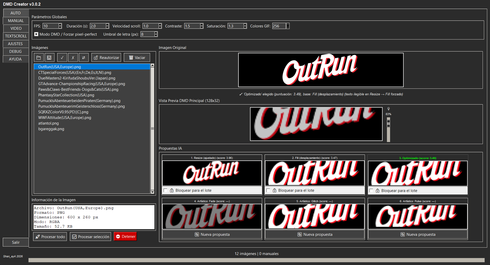
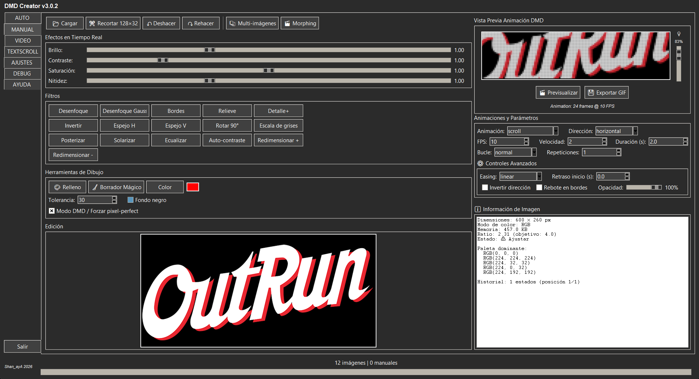
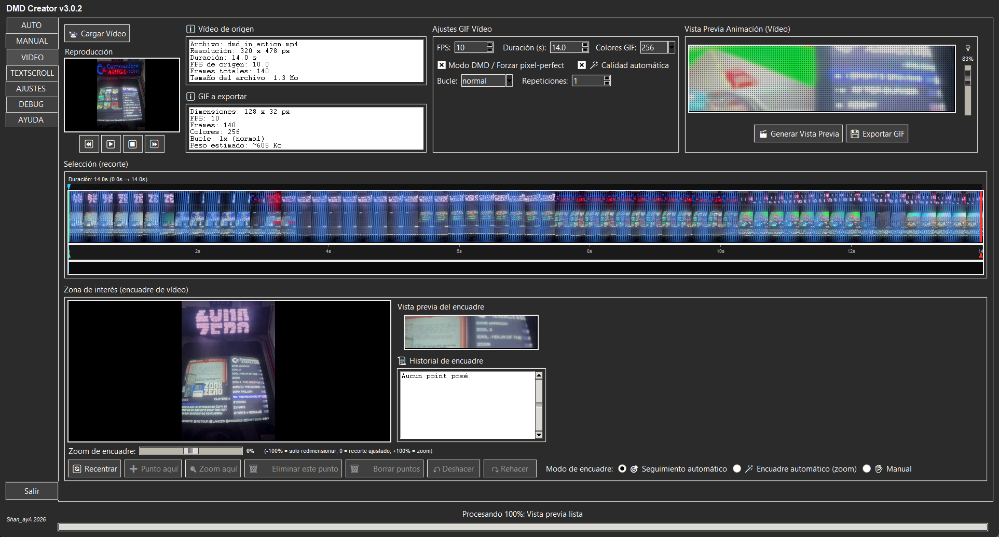
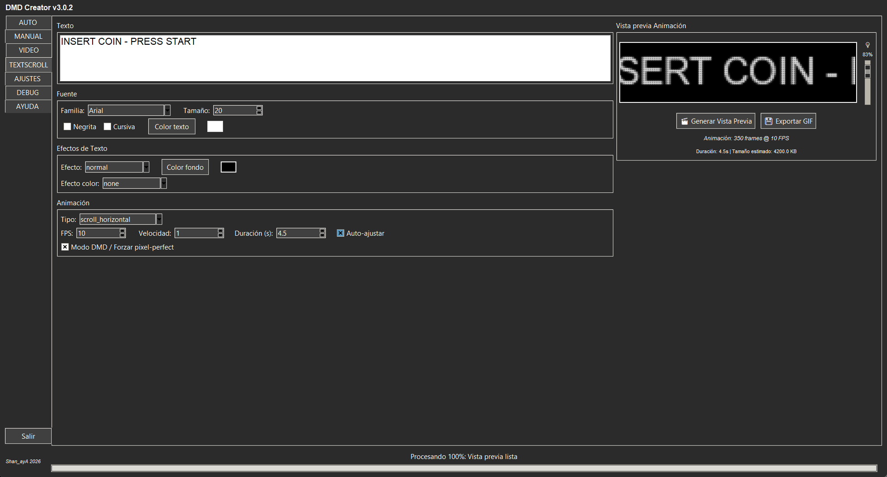

[🇫🇷 Français](./README.md) · [🇬🇧 English](./README_EN.md) · 🇪🇸 **Español**

# DMD GIF Creator 128x32 — v3.0.2

Cree GIF optimizados para pantallas DMD 128×32 (máquina arcade, pinball,
[RecalBox DMD](https://github.com/shan-aya/RecalBoxDMD)) a partir de **imágenes**, de
un **vídeo** o de **texto animado**, con análisis automático, edición manual avanzada y
procesamiento por lotes de carpetas enteras.

(Antes « DMD GIF Converter ».)

## Descarga

**Windows**: descargue `dmd_gif_creator_v302.exe` desde la
[última Release](https://github.com/shan-aya/DMD_GIF_converter/releases/latest) y
ejecútelo — no hace falta instalar nada.

**Desde las fuentes** (carpeta [`dmd_gif_creator/`](./dmd_gif_creator)):

    pip install pillow numpy tkinterdnd2 markdown opencv-contrib-python
    python dmd_gif_creator/dmd_gif_creator_v302.py

`opencv-contrib-python` (y no `opencv-python`) es necesario para el seguimiento
automático de la pestaña VIDEO; los dos paquetes no deben instalarse a la vez.

## Qué hace la aplicación

### AUTO — una imagen, seis propuestas

Arrastre y suelte imágenes o carpetas enteras (PNG, JPG, BMP, GIF, raw565). Para cada
imagen, la aplicación calcula dos renders 128×32 — **Resize** (la imagen entera
reducida) y **Fill** (la imagen más grande, con desplazamiento) — y los puntúa según
la ocupación de la pantalla y la legibilidad. Se conserva el mejor y luego se afina
(limpieza, pixel-perfect). **Si el texto queda demasiado pequeño para leerse en
Resize, se impone Fill**, aunque Resize tenga mejor puntuación. Tres variantes
artísticas completan las seis propuestas; la vista previa LED (con lupa) muestra el
render real del panel.

El **procesamiento por lotes** aplica el mismo análisis a cada imagen de una carpeta —
por ejemplo todos los logos scrapeados de una ludoteca: cada logo recibe el modo de
render que le conviene, en paralelo, conservando el árbol de carpetas y sin modificar
nunca los archivos de origen. Una propuesta puede bloquearse para todo el lote.

### MANUAL — edición avanzada

Recorte 128×32, brillo, contraste, saturación, nitidez, filtros, relleno y goma
mágica, animaciones (desplazamiento, zoom, fundido…) con easing y bucle,
multi-imágenes y morphing, historial deshacer/rehacer.

### VIDEO — un GIF a partir de un vídeo

Elija un fragmento de un vídeo (MP4, AVI, MOV, MKV) en la línea de tiempo y luego el
encuadre: seguimiento automático de un sujeto, encuadre automático con zoom o puntos
manuales (zona y zoom que evolucionan en el tiempo). La calidad automática ajusta
contraste, saturación y brillo según el vídeo, y el peso del GIF se estima en directo.

### TEXTSCROLL — texto animado

Fuente, tamaño, colores, efectos de texto y de color, y numerosas animaciones
(desplazamiento horizontal o vertical, ola, Star Wars, máquina de escribir, lluvia
Matrix, glitch…), con una duración ajustada automáticamente a la longitud del texto.

### Además

- **AJUSTES**: valores por defecto, idioma (francés, inglés, español).
- **DEBUG**: registro detallado y filtrable.
- **AYUDA**: la guía completa dentro de la aplicación.

## Novedades

**v3.0.2**
- Pestaña AUTO totalmente traducida al inglés y al español (nombres de las
  propuestas, línea de estado, barra de estado).

**v3.0.1**
- Procesamiento por lotes unas **2,4 veces más rápido**: hasta 12 imágenes en paralelo
  según el procesador, y codificación GIF acelerada.
- Traducción más completa de la interfaz al inglés y al español.

**v3.0**
- Pestaña **VIDEO**, pestaña **AYUDA**, **arrastrar y soltar** en cualquier lugar de la
  ventana.
- **Vista previa LED** en todas las pestañas de creación.
- Procesamiento por lotes en paralelo, carpetas de decenas de miles de imágenes
  cargadas sin congelar la ventana.
- Formato raw565 como entrada, deshacer/rehacer en MANUAL, ayudas emergentes.

Historial completo (en francés): [CHANGELOG_FR](./CHANGELOG_FR)

## Documentación

Guía completa: [🇫🇷 Français](./NOTICE_FR.md) · [🇬🇧 English](./NOTICE_EN.md) ·
[🇪🇸 Español](./NOTICE_ES.md) — también disponible dentro de la aplicación, pestaña
**AYUDA**.

---

## 🤝 Agradecimientos

- [RetroPixelLED original](https://github.com/fjgordillo86/RetroPixelLED)
- Visual Studio Code
- [Sixth](https://trysixth.com/)

## ☕ Apoyar el proyecto

Si este proyecto te ha ayudado, puedes invitarme a un café:
👉 [☕ Donate via PayPal](https://www.paypal.com/paypalme/felysaya)

## Contacto

Para cualquier pregunta, sugerencia o contribución, abra un issue o contacte con el
autor Shan_ayA.

---

© 2026 Shan_ayA
