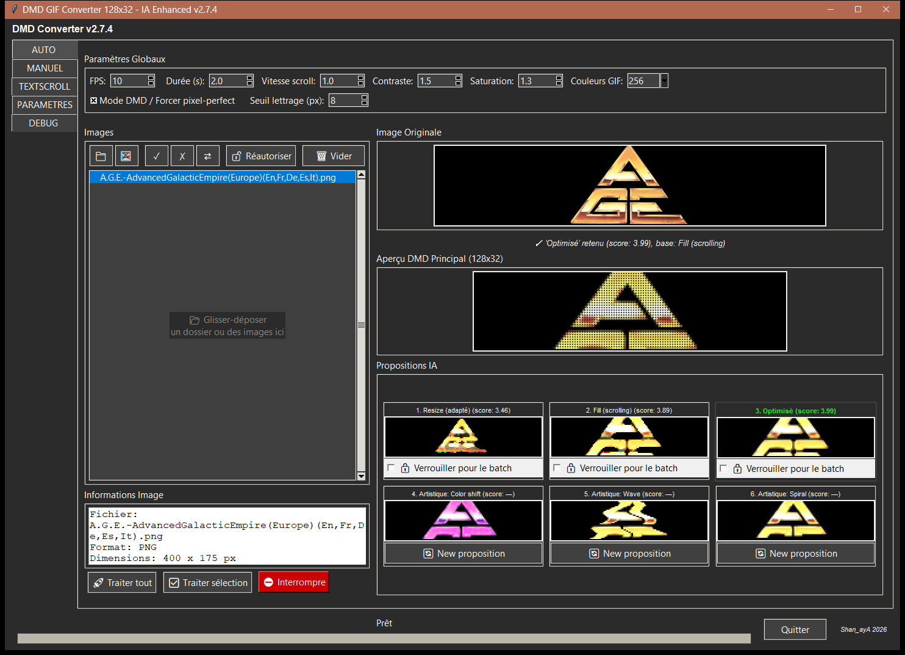
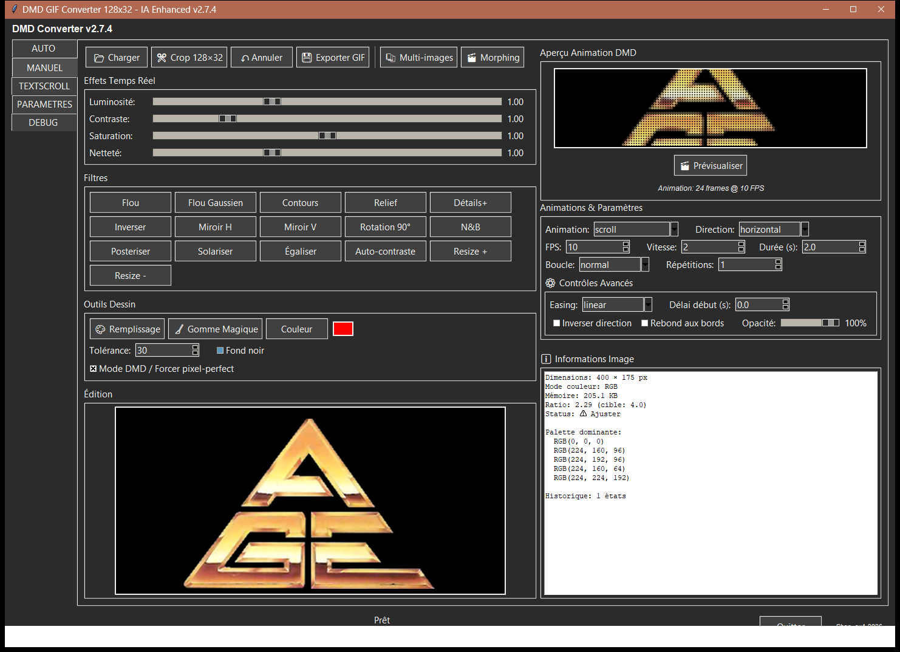
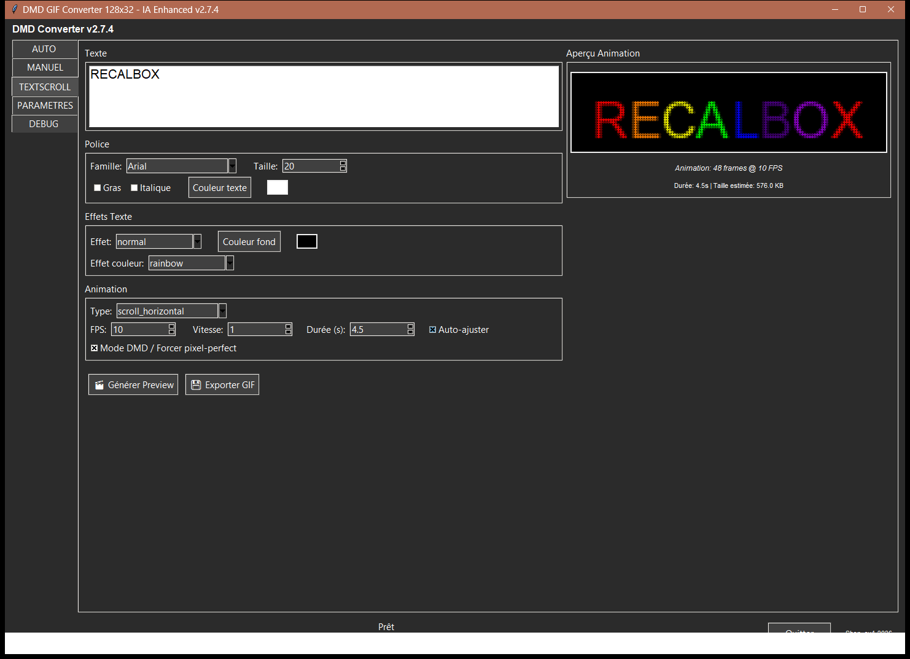
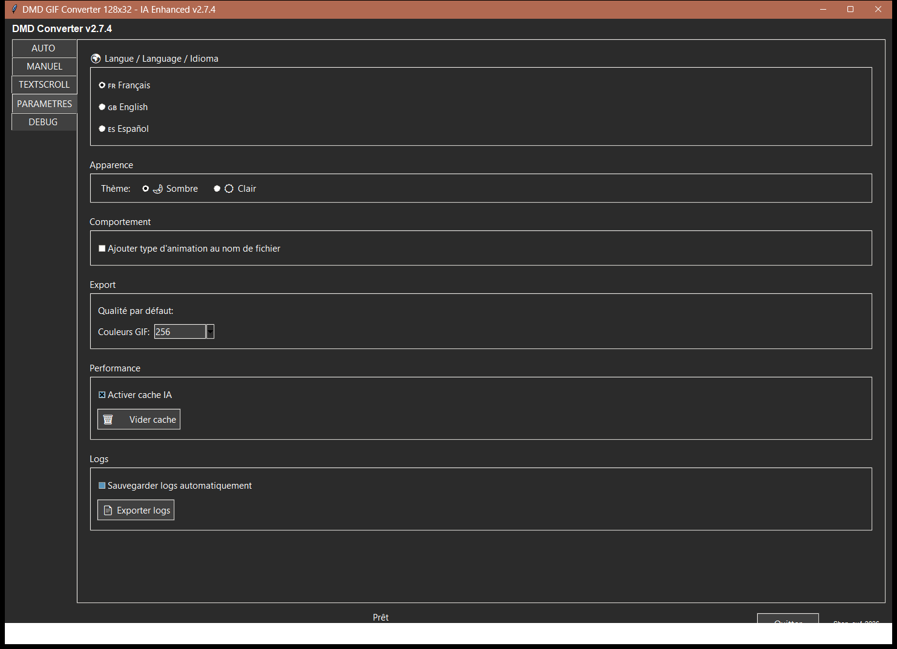
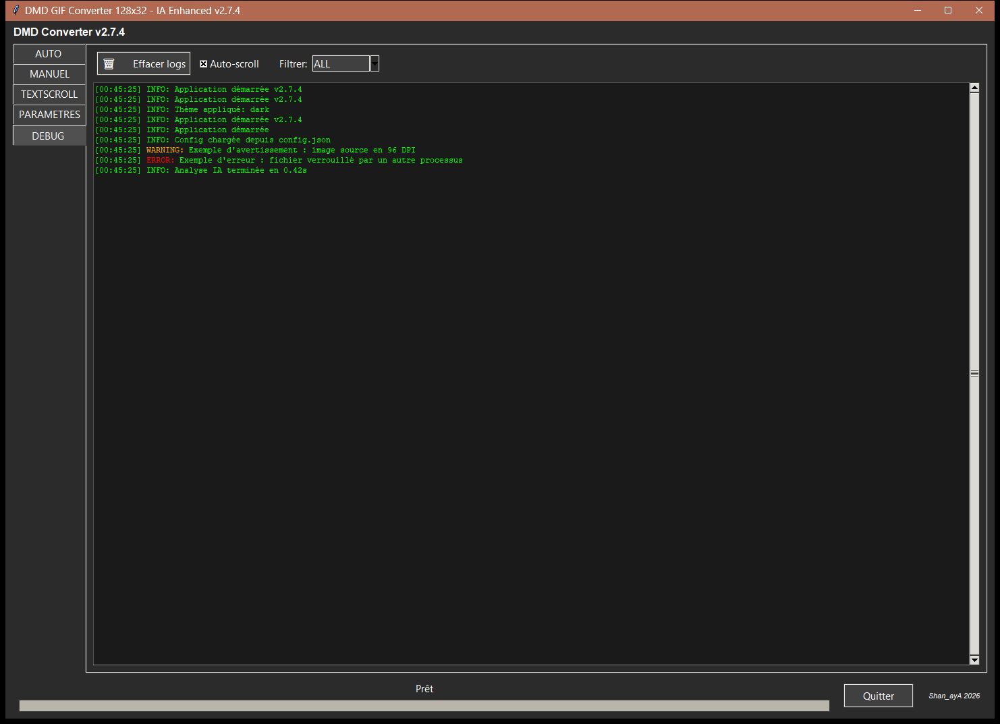

# DMD GIF Creator — Guide d'utilisation

Application Python/Tkinter permettant de convertir des images, logos et textes en
animations GIF optimisées pour un afficheur DMD 128×32 (arcade / flipper / borne
RetroBox). Ce guide décrit, onglet par onglet, chaque fonction de l'interface et son
usage concret.

> Guide à jour pour la version **3.0**. Les captures d'écran datent de la version
> **2.7.4** (thème sombre, interface en français) : l'onglet VIDEO et l'onglet AIDE,
> apparus depuis, n'y figurent pas.

---

## Menu

1. [Vue d'ensemble](#vue-densemble)
2. [Onglet AUTO — analyse et propositions IA](#onglet-auto--analyse-et-propositions-ia)
3. [Onglet MANUEL — édition avancée](#onglet-manuel--édition-avancée)
4. [Onglet VIDEO — GIF à partir d'une vidéo](#onglet-video--gif-à-partir-dune-vidéo)
5. [Onglet TEXTSCROLL — texte animé](#onglet-textscroll--texte-animé)
6. [Onglet PARAMÈTRES](#onglet-paramètres)
7. [Onglet DEBUG](#onglet-debug)
8. [Onglet AIDE](#onglet-aide)
9. [Notion transversale : Mode DMD / Forcer pixel-perfect](#notion-transversale--mode-dmd--forcer-pixel-perfect)
10. [Bonnes pratiques et limites connues](#bonnes-pratiques-et-limites-connues)

---

## Vue d'ensemble

Au lancement, l'application affiche une colonne d'onglets sur la gauche :

**AUTO** · **MANUEL** · **VIDEO** · **TEXTSCROLL** · **PARAMÈTRES** · **DEBUG** · **AIDE**

Chaque onglet correspond à une méthode différente pour produire une animation GIF
128×32 :

| Onglet | Usage |
|---|---|
| AUTO | Vous chargez une ou plusieurs images (logos, artworks...), l'IA analyse chacune et propose 6 rendus prêts à l'emploi. Le plus rapide pour traiter un lot d'images. |
| MANUEL | Vous chargez une image et réglez vous-même chaque paramètre (effets, animation, dessin) — contrôle total, sans automatisme. |
| VIDEO | Vous chargez une vidéo, choisissez le passage et le cadrage (suivi automatique ou à la main), et obtenez un GIF 128×32. |
| TEXTSCROLL | Vous tapez du texte et choisissez une police/un effet/une animation — pas besoin d'image source. |
| PARAMÈTRES | Langue, thème, réglages d'export et de performance de l'application. |
| DEBUG | Journal d'activité de l'application (logs), utile pour diagnostiquer un problème. |
| AIDE | Ce guide, dans la langue de l'interface. |

Survoler un réglage peu évident (pixel-perfect, seuil lettrage, tolérance, easing,
modes de cadrage vidéo...) affiche une **infobulle d'aide** dans la langue de
l'interface.

---

## Onglet AUTO — analyse et propositions IA

C'est l'onglet le plus complet : chargement en masse, analyse automatique de
lisibilité/occupation, et génération de 6 propositions de rendu par image.

### 1. Paramètres Globaux (bandeau du haut)

Ces réglages s'appliquent à **toutes** les propositions et à tout traitement par lot :

- **FPS** : nombre d'images par seconde de l'animation générée (1 à 60).
- **Durée (s)** : durée cible de l'animation en secondes.
- **Vitesse scroll** : vitesse de défilement en mode Fill/scroll (0.1 à 10, permet un
  défilement plus lent qu'1 pixel/frame).
- **Contraste** / **Saturation** : intensité appliquée par le moteur d'optimisation
  DMD (`optimize_for_dmd`) avant rendu — une protection interne empêche ces réglages
  de « cramer » les pixels déjà clairs en blanc pur.
- **Couleurs GIF** : palette de quantification finale (8 à 256 couleurs).
- **Mode DMD / Forcer pixel-perfect** : voir la
  [section dédiée](#notion-transversale--mode-dmd--forcer-pixel-perfect) plus bas —
  cette case est **partagée avec les onglets MANUEL et TEXTSCROLL** (la cocher ici la
  coche partout).
- **Seuil lettrage (px)** (6 à 11, défaut 8) : hauteur minimale (en pixels, après mise
  à l'échelle) qu'une lettre doit conserver pour être jugée lisible. En dessous, le
  moteur bascule automatiquement la proposition « Optimisé » sur un mode Fill/scroll
  plutôt qu'un Resize qui rendrait le texte illisible.

Modifier n'importe lequel de ces réglages relance automatiquement l'analyse de l'image
actuellement sélectionnée.

### 2. Cadre « Images » (colonne gauche)

- **📁** : ajoute un dossier entier (toujours scanné récursivement — un dossier
  contenant uniquement des sous-dossiers est donc bien pris en compte).
- **🖼️** : ajoute un ou plusieurs fichiers image individuellement.
- **Glisser-déposer** : possible n'importe où dans la fenêtre (dossier ou fichiers).
- **✓ / ✗ / ⇄** : sélectionner tout / désélectionner tout / inverser la sélection dans
  la liste.
- **🔓 Réautoriser** : réautorise une image précédemment marquée comme déjà exportée
  (voir ci-dessous).
- **🗑 Vider** : vide entièrement la liste.
- Formats acceptés : **PNG, JPG, BMP, GIF et raw565** (le format brut RGB565 lu
  par le DMD — pratique pour retravailler des images déjà converties).
- **Gros dossiers** : le scan se fait en arrière-plan, la fenêtre reste utilisable ;
  la barre de titre affiche « Recherche d'images… n » tant qu'il n'est pas fini.
  Plusieurs dizaines de milliers d'images se chargent en quelques secondes.
- Chaque ajout est **additif** (n'écrase pas la liste existante) et dédoublonné.
- Clic-droit sur une image ou touche `Suppr` : retire l'image sélectionnée de la
  liste (menu contextuel « 🗑 Retirer de la liste »).
- Cliquer sur une image dans la liste lance son analyse et affiche son aperçu.

### 3. Cadre « Informations Image »

Affiche, pour l'image sélectionnée : nom de fichier, format, dimensions, mode couleur,
taille sur disque, palette dominante détectée et ratio largeur/hauteur comparé à la
cible DMD (4.0 = 128/32).

### 4. Aperçus centraux

- **Image Originale** : l'image source telle quelle (fond noir garanti même sur un
  PNG à transparence).
- **Aperçu DMD Principal (128×32)** : le rendu de la proposition actuellement
  sélectionnée, agrandi à l'écran. Animé en continu (scroll, effets...). Si
  « Mode DMD / Forcer pixel-perfect » est coché, chaque frame est simulée en style LED
  physique (points ronds avec halo) au lieu d'un simple agrandissement carré.
- Sous l'aperçu original, un message de statut indique quelle proposition a été
  retenue automatiquement et pourquoi (ex. « 'Optimisé' retenu (score : 3.99), base :
  Fill (scrolling) », ou « texte illisible en Resize → Fill forcé » quand le seuil de
  lettrage a déclenché un forçage).

### 5. Propositions IA (grille 3×2)

Pour chaque image, 6 rendus sont calculés et affichés en miniature :

| # | Nom | Principe |
|---|---|---|
| 1 | Resize (adapté) | L'image entière est mise à l'échelle pour tenir dans 128×32 sans rognage (letterboxing). |
| 2 | Fill (scrolling) | L'image remplit toute la hauteur 32px, généralement plus large que 128px → défile horizontalement. |
| 3 | Optimisé | Le meilleur des deux ci-dessus (au score le plus élevé), avec nettoyage et pixel-perfect testés et gardés seulement s'ils améliorent le rendu. C'est la proposition retenue par défaut pour le traitement par lot. |
| 4-6 | Artistique 1-3 | Un effet du mode MANUEL (color_shift, wave, spiral, fade, pulse, zoom...) appliqué par-dessus l'animation de la proposition 3, choisi selon les caractéristiques de l'image (densité de contours, coloration). |

- **Cliquer sur une vignette** sélectionne cette proposition pour l'aperçu principal
  et pour l'export.
- Survoler une vignette affiche une infobulle avec le détail des paramètres utilisés.
- **Propositions 1-3** : case « 🔒 Verrouiller pour le batch » — force cette
  proposition précise (au lieu du meilleur score automatique) pour **toutes** les
  images traitées en lot ensuite. Une seule proposition peut être verrouillée à la
  fois.
- **Propositions 4-6** : bouton « 🔄 New proposition » — tire un nouvel effet
  artistique aléatoire (différent du précédent) pour cette case.

### 6. Traitement par lot

- **🚀 Traiter tout** : exporte un GIF pour chaque image de la liste.
- **✅ Traiter sélection** : exporte uniquement les images sélectionnées dans la
  liste.
- **⛔ Interrompre** : arrête un traitement en cours.
- Un dossier de sortie est demandé au premier lancement ; l'arborescence relative des
  images sources (par rapport au dossier chargé) est reconstruite dans le dossier de
  sortie. À la fin, un message propose d'ouvrir directement le dossier de sortie.
- Les images sont traitées **en parallèle** (jusqu'à 4 à la fois selon le nombre de
  cœurs du processeur) : un lot se termine nettement plus vite qu'image par image.

---

## Onglet MANUEL — édition avancée

Contrôle total, sans aucune automatisation de lisibilité : c'est vous qui choisissez
chaque effet et chaque paramètre d'animation.

### 1. Barre d'outils (haut)

- **📂 Charger** : charge une image depuis le disque.
- **✂️ Crop 128×32** : active un mode de recadrage manuel à la taille cible.
- **↶ Annuler** / **↷ Rétablir** : historique undo/redo incrémental. Chaque
  filtre, remplissage, gomme magique ou recadrage est un point d'historique ;
  annuler puis rétablir retrouve exactement les états intermédiaires (pas
  seulement le début/la fin). Effectuer une nouvelle action après un annuler
  efface la branche « rétablir » suivante, comme dans un éditeur classique. Les
  4 curseurs d'effets temps réel (section suivante) ne créent pas de point
  d'historique (ajustement continu, pas une action ponctuelle).
- **💾 Exporter GIF** : exporte l'animation actuellement générée.
- **📚 Multi-images** : charge plusieurs images pour un morphing (fait apparaître la
  liste « Images chargées (morphing) » juste en dessous).
- **🎬 Morphing** : génère une animation de transition fondue entre les images
  multi-chargées.

### 2. Effets Temps Réel

4 curseurs appliqués **immédiatement** sur l'image affichée (mécanisme séparé du
moteur d'optimisation d'AUTO — aucune protection anti-écrêtage automatique n'est
appliquée ici, le contrôle est volontairement laissé entier à l'utilisateur) :

- **Luminosité** (0.5–2.0), **Contraste** (0.5–3.0), **Saturation** (0.0–2.0),
  **Netteté** (0.0–3.0).

### 3. Filtres

Boutons à effet immédiat et cumulatif : Flou, Flou Gaussien, Contours, Relief,
Détails+, Inverser, Miroir H, Miroir V, Rotation 90°, N&B, Postériser, Solariser,
Égaliser, Auto-contraste, Resize + / Resize -.

### 4. Outils Dessin

- **🎨 Remplissage** : mode pot de peinture (clic sur l'image = remplit la zone de
  couleur contiguë avec la couleur choisie, selon la **Tolérance** réglée).
- **🧹 Gomme Magique** : efface (rend transparent/noir) une zone de couleur similaire
  au clic, même logique de tolérance.
- **Couleur** : choix de la couleur active pour le remplissage (aperçu affiché à
  droite du bouton).
- **Tolérance** : sensibilité de détection de couleur pour le remplissage/la gomme
  (0–100).
- **Fond noir** : case indicative liée au rendu de fond.
- **Mode DMD / Forcer pixel-perfect** : case partagée avec AUTO et TEXTSCROLL, voir
  [section dédiée](#notion-transversale--mode-dmd--forcer-pixel-perfect).

### 5. Édition

Canvas principal (640×480) affichant l'image en cours de modification — c'est ici que
s'appliquent les clics des outils de dessin.

### 6. Aperçu Animation DMD (colonne droite)

- Canvas 512×128 montrant l'animation en boucle. Si « Mode DMD / Forcer
  pixel-perfect » est coché, rendu en simulation LED (comme dans AUTO) ; sinon rendu
  classique agrandi au carré.
- **🎬 Prévisualiser** : (re)génère l'animation à partir des réglages actuels.

### 7. Animations & Paramètres

- **Animation** : 18 types disponibles (scroll, fade_in/out, zoom_in/out, rotate,
  wave, bounce, flash, slide_left/right, spiral, shake, pulse, glitch, pixelate,
  blur_transition, color_shift).
- **Direction** : horizontal / vertical (pertinent pour les animations de type
  scroll).
- **FPS**, **Vitesse**, **Durée (s)** : mêmes principes que dans AUTO mais avec des
  réglages propres à l'onglet MANUEL (non partagés).
- **Boucle** : normal / ping-pong / infini, avec un nombre de **Répétitions**.
- **⚙️ Contrôles Avancés** : appliqués en post-traitement sur les frames déjà
  générées, quel que soit le type d'animation choisi.
  - **Easing** (linear/ease-in/ease-out/ease-in-out/bounce) : change la vitesse
    relative de lecture au fil de l'animation (accélère/ralentit le début ou la
    fin) sans changer le nombre de frames ni la durée totale.
  - **Délai début (s)** : ajoute des frames statiques (image de départ figée) au
    tout début de l'animation, une seule fois (pas répété à chaque boucle).
  - **Inverser direction** : joue la séquence de frames en ordre inverse.
  - **Rebond aux bords** : la séquence va-et-vient (aller-retour) au lieu de
    s'arrêter ou boucler sec en bout de course, sur la même durée totale.
  - **Opacité** : fondu global de l'animation vers le noir, appliqué en dernier.

### 8. Informations Image

Mêmes informations que dans AUTO (dimensions, mode couleur, mémoire, ratio, palette
dominante), plus le nombre d'états dans l'historique d'annulation.

---

## Onglet VIDEO — GIF à partir d'une vidéo

Transforme un passage d'une vidéo (MP4, AVI, MOV, MKV) en GIF 128×32. Nécessite le
module `opencv-contrib-python` (inclus dans l'exécutable Windows) ; s'il manque,
l'onglet l'indique.

### 1. Charger et lire

- **📹 Charger Vidéo** : ouvre un fichier vidéo. On peut aussi **glisser-déposer**
  une vidéo n'importe où dans la fenêtre, quel que soit l'onglet affiché.
- **Lecture** : la vidéo tourne en boucle en miniature. **Cliquer dessus** l'ouvre en
  taille réelle dans le lecteur vidéo de Windows.
- **ℹ️ Vidéo Source** : nom du fichier, définition, durée, images par seconde, nombre
  total d'images et taille du fichier.

### 2. Paramètres GIF Vidéo

- **FPS** (1 à 60) : réglé au départ sur celui de la vidéo.
- **Durée (s)** : durée du GIF ; par défaut, la longueur de la sélection.
- **Couleurs GIF** : 8 à 256.
- **Mode DMD / Forcer pixel-perfect** : même case que dans les autres onglets.
- **🪄 Qualité automatique** : ajuste contraste, saturation et luminosité d'après
  quelques images de la vidéo avant le rendu DMD.
- **Boucle** (normal / ping-pong / infini) et **Répétitions**.
- **ℹ️ GIF à exporter** et **Poids GIF estimé** : récapitulatif mis à jour en direct.

### 3. Sélection (trim)

Une frise de vignettes montre la vidéo. La **poignée verte** (début) et la **poignée
rouge** (fin) délimitent le passage gardé : on les déplace en les faisant glisser, un
simple clic ailleurs ne les bouge pas. La durée sélectionnée est affichée au-dessus
de la frise.

La **ligne cyan** (avec son triangle) est le **temps de cadrage** : déplacez-la pour
parcourir la vidéo et voir ou modifier le cadrage à cet instant, sans changer la
sélection.

### 4. Zone d'intérêt (cadrage vidéo)

La vidéo est rarement au format 128×32 : on choisit quelle partie de l'image garder.
**Mode de cadrage** — trois modes, un seul actif à la fois :

| Mode | Principe |
|---|---|
| 🎯 **Suivi automatique** | Vous dessinez un rectangle une fois sur le sujet ; un traceur (OpenCV) le suit tout le long de la vidéo. Taille du cadre calculée automatiquement. |
| 🪄 **Cadrage auto (zoom)** | Vous placez vous-même le cadre (glissez le rectangle) ; sa taille est calculée automatiquement. Pas de suivi, un seul cadrage. |
| ✋ **Manuel** | Aucun automatisme : vous posez des points dans le temps, chacun avec sa zone et son zoom. |

En mode **✋ Manuel** :

- **➕ Point ici** : dessinez un rectangle sur la zone voulue ; au relâchement, il
  devient un point de zone au temps de cadrage courant (il remplace un point déjà
  très proche). Faites glisser l'intérieur du rectangle pour le déplacer, avec aperçu
  en direct.
- **🔍 Zoom ici** : pose un point de zoom au temps courant, avec la valeur du
  curseur **Zoom cadrage** (-100 % = image entière redimensionnée, 0 = cadre serré,
  +100 % = zoom). Entre deux points, zone et zoom évoluent progressivement.
- **🗑️ Supprimer ce point** : supprime le point le plus proche du temps courant ;
  **🗑️ Effacer points** les supprime tous ; **🔄 Recentrer** recentre le cadre.
- **Timeline des points** (sous la frise) : disque orange = point de suivi
  automatique, carré violet = point manuel, losange sarcelle = point de zoom. Faites
  glisser un point pour le déplacer dans le temps.
- **↶ Annuler** / **↷ Rétablir** : annule ou refait la dernière action sur les
  points ; **📜 Historique de cadrage** liste ces actions.

**Aperçu du cadrage** montre en direct la partie de l'image qui sera gardée.

### 5. Générer et exporter

- **🎬 Générer Aperçu** : calcule le GIF (cadrage, qualité, rendu DMD) et l'anime
  dans **Aperçu Animation (Vidéo)** — avec, en Mode DMD, la loupe 🔍 et le curseur
  💡 Luminosité LED comme dans les autres onglets.
- **💾 Exporter GIF** : enregistre le GIF.

---

## Onglet TEXTSCROLL — texte animé

Génère une animation directement à partir de texte saisi, sans image source.

### 1. Texte

Zone de saisie multi-lignes ; le texte tapé est rendu directement en image DMD (pas de
chargement de fichier, donc aucun souci de transparence/PNG ici).

### 2. Police

- **Famille** : liste des polices système disponibles.
- **Taille** : 8 à 48 px.
- **Gras** / **Italique**.
- **Couleur texte** : sélecteur de couleur (aperçu à droite).

### 3. Effets Texte

- **Effet** : normal, 3d, fire, snow, ice, metal, neon, graffiti, pixel_art, outline,
  shadow.
- **Couleur fond** : couleur d'arrière-plan du rendu texte.
- **Effet couleur** (actif uniquement avec l'effet « normal ») : none, rainbow,
  matrix, fire, gradient.

### 4. Animation

- **Type** : scroll_horizontal, scroll_vertical, scroll_wave, starwars,
  bounce_scroll, typewriter, explode, matrix_rain, spiral, shake, glitch, fade_in,
  static.
- **FPS**, **Vitesse**, **Durée (s)** (auto-ajustée si le texte est long).
- **Auto-ajuster** : allonge automatiquement la durée pour les textes de plus de 50
  caractères.
- **Mode DMD / Forcer pixel-perfect** : case partagée avec AUTO et MANUEL — bascule
  l'aperçu en rendu LED simulé (voir
  [section dédiée](#notion-transversale--mode-dmd--forcer-pixel-perfect)).

### 5. Actions

- **🎬 Générer Preview** : calcule l'animation et l'affiche dans le cadre « Aperçu
  Animation » (nombre de frames, FPS et taille estimée du GIF indiqués sous le
  canvas).
- **💾 Exporter GIF** : exporte l'animation générée.

---

## Onglet PARAMÈTRES

Réglages globaux de l'application (pas liés à une image ou un projet particulier) :

- **🌍 Langue** : Français / English / Español — nécessite un redémarrage de
  l'application pour s'appliquer entièrement.
- **Apparence** : thème Sombre ou Clair (appliqué immédiatement).
- **Comportement** : case « Ajouter type d'animation au nom de fichier » à l'export.
- **Export** : nombre de couleurs GIF par défaut (8 à 256).
- **Performance** : case « Activer cache IA » et bouton « 🗑️ Vider cache ».
- **Logs** : case « Sauvegarder logs automatiquement » et bouton « 📄 Exporter logs »
  (écrit le journal d'activité dans un fichier).

---

## Onglet DEBUG

Journal d'activité de l'application en temps réel — utile pour diagnostiquer une
erreur ou comprendre ce que fait l'IA en arrière-plan.

- **🗑️ Effacer logs** : vide l'affichage (et l'historique interne des logs).
- **Auto-scroll** : garde toujours la dernière ligne visible.
- **Filtrer** : ALL / INFO / WARNING / ERROR / DEBUG — n'affiche que les entrées du
  niveau choisi.
- Chaque ligne est horodatée et colorée selon son niveau (vert = INFO, orange =
  WARNING, rouge = ERROR, bleu = DEBUG).

---

## Onglet AIDE

Affiche ce guide dans la langue choisie dans PARAMÈTRES (français, anglais ou
espagnol), aux couleurs du thème. Le menu en tête du guide est cliquable.
**🌐 Ouvrir dans le navigateur** ouvre le fichier du guide avec le programme associé
aux fichiers `.md` sur votre PC.

---

## Notion transversale : Mode DMD / Forcer pixel-perfect

Cette case à cocher existe dans les **quatre** onglets de génération (AUTO, MANUEL,
VIDEO, TEXTSCROLL) et pointe vers **la même variable** : la cocher dans un onglet la
coche automatiquement dans les autres.

Elle a deux effets combinés :

1. **Mise à l'échelle** : impose un facteur d'échelle entier exact plutôt qu'un
   redimensionnement à échelle fractionnaire, pour un alignement pixel parfait sur la
   grille DMD.
2. **Rendu d'aperçu** : dans les 4 canvas d'aperçu animé, chaque frame est simulée en
   style LED physique (points ronds séparés par un bezel sombre, avec un léger halo)
   au lieu d'un simple agrandissement carré — pour visualiser à l'écran un rendu
   proche de l'affichage réel sur la borne. Si la case est décochée, l'aperçu revient
   au rendu classique (agrandissement carré net).

Deux compléments disponibles dans les 4 mêmes onglets, uniquement quand la case est
cochée :

- **🔍 Loupe au survol** : survoler le canvas d'aperçu fait apparaître une icône loupe
  en haut à droite. Cliquer dessus ouvre une fenêtre séparée avec le rendu LED
  agrandi, animée en direct en synchronisation avec l'aperçu normal.
- **💡 Luminosité LED** : curseur vertical à côté du canvas (0-100 %, 50 % par
  défaut). Simule le réglage de luminosité physique d'un panneau LED : plus lumineux
  pousse les couleurs vers le blanc et accentue le halo de bloom (une LED plus
  lumineuse « bave » davantage sur ses voisines) ; moins lumineux assombrit et réduit
  le halo. 50 % correspond au rendu neutre par défaut.

---

## Bonnes pratiques et limites connues

- **Images à fond transparent (PNG RGBA)** : gérées correctement partout (le fond
  transparent est toujours composité sur du noir, jamais laissé tel quel) — évite les
  halos blancs/colorés autour des logos détourés.
- **Onglet MANUEL, sliders temps réel** : aucune protection contre l'écrêtage des
  hautes lumières (contrairement à AUTO) — à forte valeur de contraste/saturation, il
  est possible de « cramer » des pixels clairs en blanc pur ; c'est un choix assumé
  pour laisser le contrôle total à l'utilisateur.
- **Seuil lettrage** (AUTO) : un réglage plus bas (6) tolère des lettres plus petites
  avant de forcer le mode Fill ; un réglage plus haut (11) est plus prudent et force
  Fill plus souvent. La valeur par défaut (8) est un compromis validé sur un corpus de
  logos réels.
