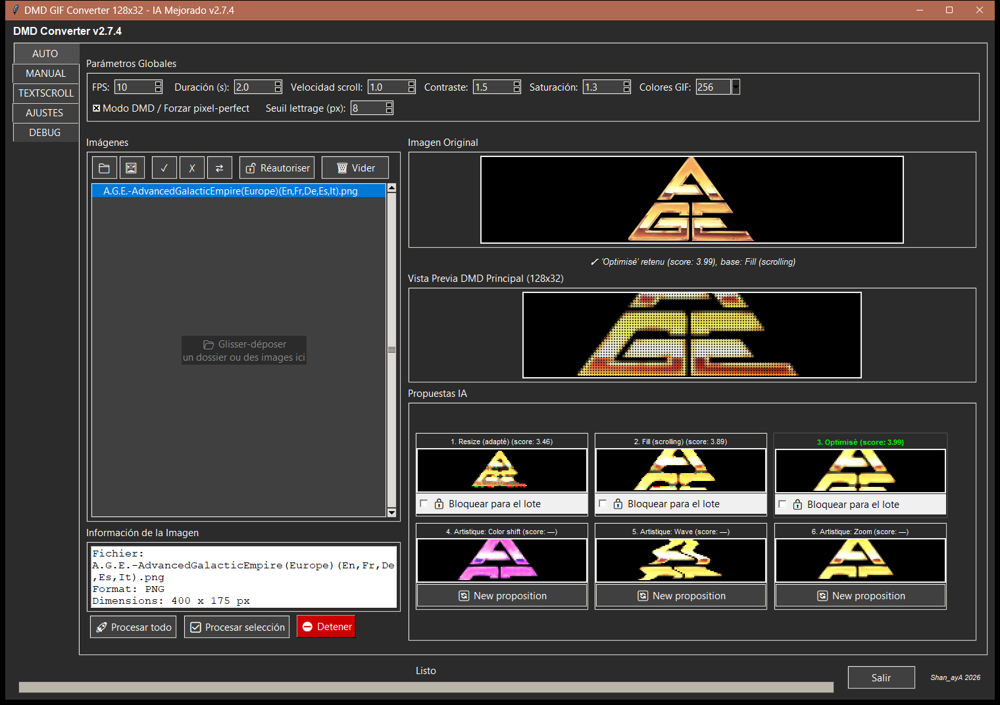
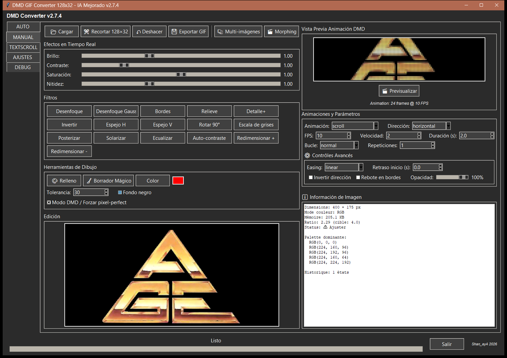
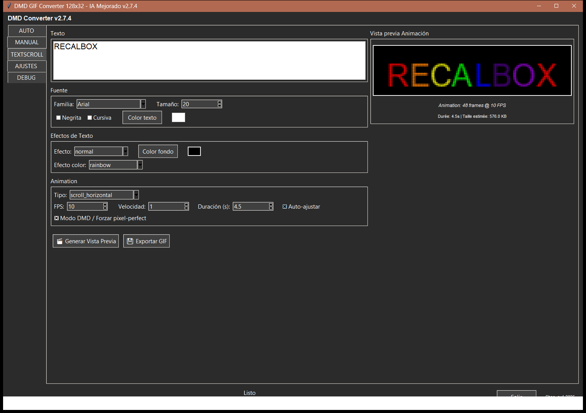
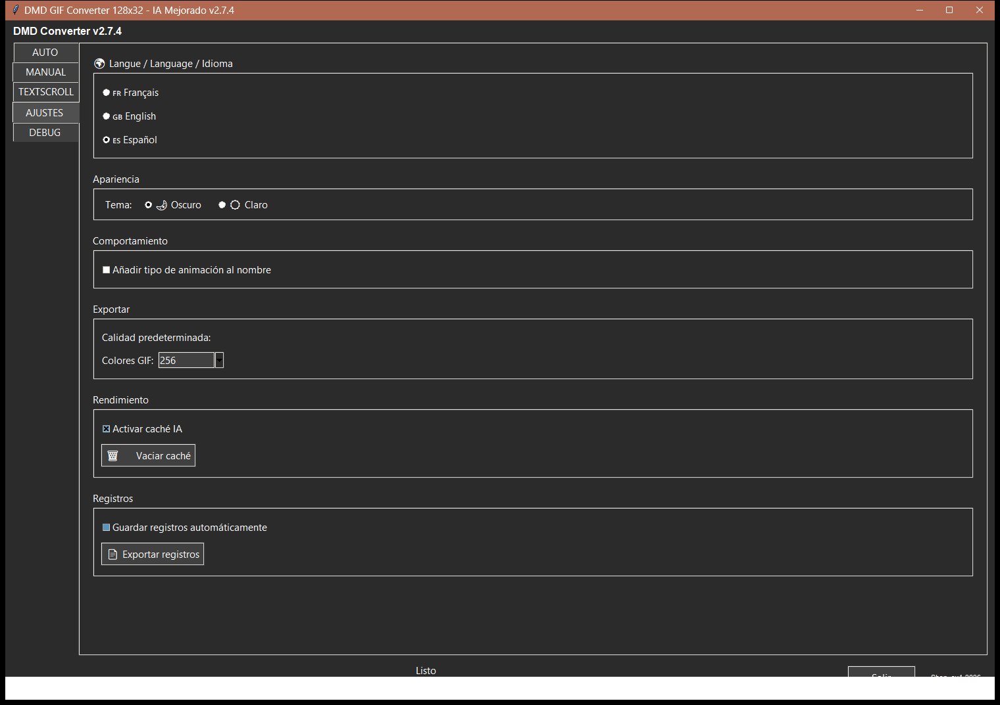
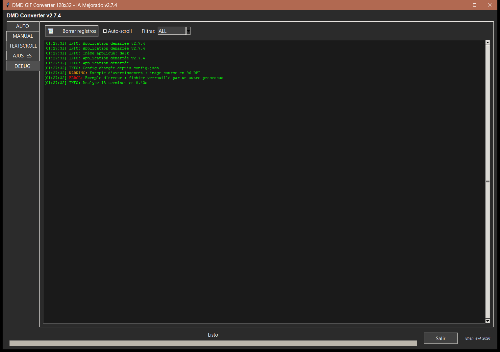

# DMD GIF Creator — Guía de uso

Aplicación Python/Tkinter que convierte imágenes, logotipos y texto en animaciones
GIF optimizadas para una pantalla DMD 128×32 (arcade / pinball / mueble RetroBox).
Esta guía describe, pestaña por pestaña, cada función de la interfaz y su uso
concreto.

> Guía actualizada para la versión **3.0**. Las capturas se hicieron con la versión
> **2.7.4**, tema oscuro, interfaz en español: las pestañas VIDEO y AYUDA, añadidas
> después, no aparecen.
>
> **Nota sobre la localización:** algunas etiquetas y paneles de información (por
> ejemplo los nombres de campo de los paneles "Información de la Imagen" y "Vídeo de
> origen", como `Fichier:` o `Résolution:`) pueden aparecer todavía en francés sea
> cual sea el idioma elegido, igual que los mensajes de la pestaña DEBUG. Las capturas
> de abajo, hechas con una versión anterior, muestran algunas palabras en francés por
> el mismo motivo.

---

## Menú

1. [Visión general](#visión-general)
2. [Pestaña AUTO — análisis y propuestas de IA](#pestaña-auto--análisis-y-propuestas-de-ia)
3. [Pestaña MANUAL — edición avanzada](#pestaña-manual--edición-avanzada)
4. [Pestaña VIDEO — GIF a partir de un vídeo](#pestaña-video--gif-a-partir-de-un-vídeo)
5. [Pestaña TEXTSCROLL — texto animado](#pestaña-textscroll--texto-animado)
6. [Pestaña AJUSTES](#pestaña-ajustes)
7. [Pestaña DEBUG](#pestaña-debug)
8. [Pestaña AYUDA](#pestaña-ayuda)
9. [Función transversal: Modo DMD / Forzar pixel-perfect](#función-transversal-modo-dmd--forzar-pixel-perfect)
10. [Buenas prácticas y limitaciones conocidas](#buenas-prácticas-y-limitaciones-conocidas)

---

## Visión general

Al iniciar, la aplicación muestra una columna de pestañas a la izquierda:

**AUTO** · **MANUAL** · **VIDEO** · **TEXTSCROLL** · **AJUSTES** · **DEBUG** · **AYUDA**

Cada pestaña corresponde a una forma diferente de producir una animación GIF 128×32:

| Pestaña | Uso |
|---|---|
| AUTO | Cargue una o varias imágenes (logotipos, ilustraciones...), la IA analiza cada una y propone 6 renders listos para usar. La forma más rápida de procesar un lote de imágenes. |
| MANUAL | Cargue una imagen y ajuste usted mismo cada parámetro (efectos, animación, dibujo) — control total, sin automatismos. |
| VIDEO | Cargue un vídeo, elija el fragmento y el encuadre (seguimiento automático o a mano) y obtenga un GIF 128×32. |
| TEXTSCROLL | Escriba texto y elija una fuente/efecto/animación — no necesita imagen de origen. |
| AJUSTES | Idioma, tema, ajustes de exportación y rendimiento de la aplicación. |
| DEBUG | Registro de actividad de la aplicación, útil para diagnosticar un problema. |
| AYUDA | Esta guía, en el idioma de la interfaz. |

Pasar el ratón por encima de un ajuste poco evidente (pixel-perfect, umbral de
letras, tolerancia, easing, modos de encuadre de vídeo...) muestra una **ayuda
emergente** en el idioma de la interfaz.

---

## Pestaña AUTO — análisis y propuestas de IA

Es la pestaña más completa: carga masiva, análisis automático de
legibilidad/ocupación, y generación de 6 propuestas de render por imagen.

### 1. Parámetros Globales (barra superior)

Estos ajustes se aplican a **todas** las propuestas y a cualquier procesamiento por
lotes:

- **FPS**: fotogramas por segundo de la animación generada (1 a 60).
- **Duración (s)**: duración objetivo de la animación en segundos.
- **Velocidad scroll**: velocidad de desplazamiento en modo Fill/scroll (0.1 a 10,
  permite un desplazamiento más lento que 1 píxel/fotograma).
- **Contraste** / **Saturación**: intensidad aplicada por el motor de optimización
  DMD (`optimize_for_dmd`) antes del render — una protección interna evita que estos
  ajustes "quemen" a blanco puro los píxeles ya claros.
- **Colores GIF**: paleta de cuantización final (8 a 256 colores).
- **Modo DMD / Forzar pixel-perfect**: ver la
  [sección dedicada](#función-transversal-modo-dmd--forzar-pixel-perfect) más abajo —
  esta casilla está **compartida con las pestañas MANUAL y TEXTSCROLL** (marcarla
  aquí la marca en todas partes).
- **Seuil lettrage (px)** (6 a 11, valor por defecto 8, etiqueta aún no traducida):
  altura mínima de letra (en píxeles, tras el escalado) para considerarse legible.
  Por debajo de ese valor, el motor cambia automáticamente la propuesta "Optimisé" a
  modo Fill/scroll en lugar de un Resize que dejaría el texto ilegible.

Cambiar cualquiera de estos ajustes relanza automáticamente el análisis de la imagen
seleccionada.

### 2. Panel "Imágenes" (columna izquierda)

- **📁**: añade una carpeta completa (siempre se escanea de forma recursiva — una
  carpeta que solo contiene subcarpetas se detecta correctamente).
- **🖼️**: añade uno o varios archivos de imagen individualmente.
- **Arrastrar y soltar**: funciona en cualquier parte de la ventana (carpeta o
  archivos).
- **✓ / ✗ / ⇄**: seleccionar todo / deseleccionar todo / invertir la selección en la
  lista.
- **🔓 Réautoriser** ("Reautorizar"): reautoriza una imagen previamente marcada como
  ya exportada (ver abajo).
- **🗑 Vider** ("Vaciar"): vacía la lista por completo.
- Formatos aceptados: **PNG, JPG, BMP, GIF y raw565** (el formato bruto RGB565 que
  lee el DMD — práctico para retocar imágenes ya convertidas).
- **Carpetas grandes**: el escaneo se hace en segundo plano y la ventana sigue
  utilizable; la barra de título muestra « Buscando imágenes… n » mientras no ha
  terminado. Decenas de miles de imágenes se cargan en unos segundos.
- Cada adición es **aditiva** (no sobrescribe la lista existente) y se eliminan
  duplicados.
- Clic derecho sobre una imagen, o tecla `Supr`: elimina la imagen seleccionada de la
  lista (menú contextual "🗑 Retirer de la liste").
- Hacer clic en una imagen de la lista lanza su análisis y muestra su vista previa.

### 3. Panel "Información de la Imagen"

Muestra, para la imagen seleccionada: nombre de archivo, formato, dimensiones, modo
de color, tamaño en disco, paleta dominante detectada y relación ancho/alto
comparada con el objetivo DMD (4.0 = 128/32). Las etiquetas de campo de este panel
solo están disponibles en francés por ahora (`Fichier:`, `Format:`, `Dimensions:`...).

### 4. Vistas previas centrales

- **Imagen Original**: la imagen de origen tal cual (fondo negro garantizado incluso
  en un PNG con transparencia).
- **Vista Previa DMD Principal (128×32)**: el render de la propuesta actualmente
  seleccionada, ampliado en pantalla. Animado de forma continua (scroll, efectos...).
  Si "Modo DMD / Forzar pixel-perfect" está marcado, cada fotograma se simula en
  estilo LED físico (puntos redondos con halo) en lugar de un simple ampliado
  cuadrado.
- Debajo de la vista previa original, un mensaje de estado indica qué propuesta se
  retuvo automáticamente y por qué (p. ej. "'Optimisé' retenu (score: 3.99), base:
  Fill (scrolling)", o "texte illisible en Resize → Fill forcé" cuando el umbral de
  altura de letra provocó un cambio forzado — esta línea de estado aún no está
  traducida).

### 5. Propuestas IA (cuadrícula 3×2)

Para cada imagen se calculan y muestran 6 renders en miniatura:

| # | Nombre | Principio |
|---|---|---|
| 1 | Resize (adapté) | Toda la imagen se escala para caber en 128×32 sin recortes (con bandas negras). |
| 2 | Fill (scrolling) | La imagen llena toda la altura de 32px, normalmente más ancha que 128px → se desplaza horizontalmente. |
| 3 | Optimisé | La mejor de las dos anteriores (puntuación más alta), con limpieza y pixel-perfect probados y conservados solo si mejoran el render. Es la propuesta usada por defecto en el procesamiento por lotes. |
| 4-6 | Artistique 1-3 | Un efecto de la pestaña MANUAL (color_shift, wave, spiral, fade, pulse, zoom...) aplicado sobre la animación de la propuesta 3, elegido según las características de la imagen (densidad de bordes, colorido). |

- **Al hacer clic en una miniatura** se selecciona esa propuesta para la vista previa
  principal y para la exportación.
- Al pasar el cursor sobre una miniatura aparece un tooltip con los ajustes exactos
  usados.
- **Propuestas 1-3**: casilla "🔒 Bloquear para el lote" — fuerza esta propuesta
  concreta (en lugar de la mejor puntuación automática) para **todas** las imágenes
  procesadas en el siguiente lote. Solo se puede bloquear una propuesta a la vez.
- **Propuestas 4-6**: botón "🔄 New proposition" (aún no traducido) — sortea un nuevo
  efecto artístico aleatorio (distinto del anterior) para esa casilla.

### 6. Procesamiento por lotes

- **🚀 Procesar todo**: exporta un GIF para cada imagen de la lista.
- **✅ Procesar selección**: exporta solo las imágenes seleccionadas en la lista.
- **⛔ Detener**: cancela un lote en curso.
- Se solicita una carpeta de salida en la primera ejecución; la estructura relativa
  de carpetas de las imágenes de origen (respecto a la carpeta cargada) se recrea
  dentro de la carpeta de salida. Al terminar, un mensaje ofrece abrir directamente
  la carpeta de salida.
- Las imágenes se procesan **en paralelo** (hasta 4 a la vez según el número de
  núcleos del procesador): un lote termina mucho más rápido que imagen por imagen.

---

## Pestaña MANUAL — edición avanzada

Control total, sin ningún automatismo de legibilidad: usted elige cada efecto y cada
parámetro de animación.

### 1. Barra de herramientas (arriba)

- **📂 Cargar**: carga una imagen desde el disco.
- **✂️ Recortar 128×32**: activa un modo de recorte manual al tamaño objetivo.
- **↶ Deshacer** / **↷ Rehacer**: historial de deshacer/rehacer incremental.
  Cada filtro, relleno, borrador mágico o recorte es un punto del historial;
  deshacer y luego rehacer recupera exactamente los estados intermedios (no
  solo el principio/final). Realizar una nueva acción tras deshacer borra la
  rama "rehacer" siguiente, igual que en cualquier editor estándar. Los 4
  controles deslizantes de efectos en tiempo real (siguiente sección) no crean
  puntos de historial (ajuste continuo, no una acción puntual).
- **💾 Exportar GIF**: exporta la animación actualmente generada.
- **📚 Multi-imágenes**: carga varias imágenes para hacer un morphing (aparece la
  lista "Images chargées (morphing)" justo debajo).
- **🎬 Morphing**: genera una animación de transición fundida entre las
  multi-imágenes cargadas.

### 2. Efectos en Tiempo Real

4 controles deslizantes aplicados **inmediatamente** sobre la imagen mostrada
(mecanismo totalmente independiente del motor de optimización de AUTO — aquí no se
aplica ninguna protección automática contra el recorte de altas luces, el control se
deja intencionadamente por completo en manos del usuario):

- **Brillo** (0.5–2.0), **Contraste** (0.5–3.0), **Saturación** (0.0–2.0),
  **Nitidez** (0.0–3.0).

### 3. Filtros

Botones de efecto inmediato y acumulativo: Desenfoque, Desenfoque Gaussiano, Bordes,
Relieve, Detalle+, Invertir, Espejo H, Espejo V, Rotar 90°, Escala de grises,
Posterizar, Solarizar, Ecualizar, Auto-contraste, Redimensionar + / Redimensionar -.

### 4. Herramientas de Dibujo

- **🎨 Relleno**: modo bote de pintura (clic en la imagen = rellena la zona de color
  contiguo con el color elegido, según la **Tolerancia** ajustada).
- **🧹 Borrador Mágico**: borra (deja transparente/negro) una zona de color similar al
  clic, con la misma lógica de tolerancia.
- **Color**: elige el color activo para el relleno (vista previa mostrada junto al
  botón).
- **Tolerancia**: sensibilidad de detección de color para el relleno/borrador
  (0–100).
- **Fondo negro**: casilla indicativa ligada al renderizado de fondo.
- **Modo DMD / Forzar pixel-perfect**: casilla compartida con AUTO y TEXTSCROLL, ver
  la [sección dedicada](#función-transversal-modo-dmd--forzar-pixel-perfect).

### 5. Edición (lienzo)

Lienzo principal (640×480) que muestra la imagen en edición — aquí es donde se
aplican los clics de las herramientas de dibujo.

### 6. Vista Previa Animación DMD (columna derecha)

- Lienzo de 512×128 que muestra la animación en bucle. Si "Modo DMD / Forzar
  pixel-perfect" está marcado, se renderiza en estilo LED simulado (igual que en
  AUTO); si no, render clásico ampliado en cuadrado.
- **🎬 Previsualizar**: (re)genera la animación a partir de los ajustes actuales.

### 7. Animaciones y Parámetros

- **Animación**: 18 tipos disponibles (scroll, fade_in/out, zoom_in/out, rotate,
  wave, bounce, flash, slide_left/right, spiral, shake, pulse, glitch, pixelate,
  blur_transition, color_shift).
- **Dirección**: horizontal / vertical (relevante para animaciones tipo scroll).
- **FPS**, **Velocidad**, **Duración (s)**: mismos principios que en AUTO pero con
  ajustes propios de la pestaña MANUAL (no compartidos).
- **Bucle**: normal / ping-pong / infinito, con un número de **Repeticiones**.
- **⚙️ Contrôles Avancés** (cuadro aún no traducido): se aplican como
  postprocesado sobre los fotogramas ya generados, sea cual sea el tipo de
  animación elegido.
  - **Easing** (linear/ease-in/ease-out/ease-in-out/bounce): cambia la
    velocidad relativa de reproducción a lo largo de la animación (acelera o
    ralentiza el inicio o el final) sin cambiar el número de fotogramas ni la
    duración total.
  - **Retraso inicio (s)**: añade fotogramas estáticos (imagen inicial
    congelada) al principio de la animación, una sola vez (no se repite en
    cada bucle).
  - **Invertir dirección**: reproduce la secuencia de fotogramas en orden
    inverso.
  - **Rebote en bordes**: la secuencia va y viene en lugar de detenerse o
    reiniciar bruscamente al final, dentro de la misma duración total.
  - **Opacidad**: fundido global de la animación hacia el negro, aplicado en
    último lugar.

### 8. Información de la Imagen

La misma información que en AUTO (dimensiones, modo de color, memoria, relación,
paleta dominante), más el número de estados en el historial de deshacer. Las
etiquetas de campo aquí también están disponibles solo en francés por ahora.

---

## Pestaña VIDEO — GIF a partir de un vídeo

Convierte un fragmento de un vídeo (MP4, AVI, MOV, MKV) en un GIF 128×32. Necesita
el módulo `opencv-contrib-python` (incluido en el ejecutable de Windows); si falta,
la pestaña lo indica.

### 1. Cargar y reproducir

- **📹 Cargar Vídeo**: abre un archivo de vídeo. También puede **arrastrar y soltar**
  un vídeo en cualquier lugar de la ventana, sea cual sea la pestaña mostrada.
- **Reproducción**: el vídeo se reproduce en bucle en miniatura. **Haga clic** para
  abrirlo a tamaño real en el reproductor de vídeo de Windows.
- **ℹ️ Vídeo de origen**: nombre del archivo, resolución, duración, imágenes por
  segundo, número total de imágenes y tamaño del archivo.

### 2. Ajustes GIF Vídeo

- **FPS** (1 a 60): se ajusta al principio al del vídeo.
- **Duración (s)**: duración del GIF; por defecto, la de la selección.
- **Colores GIF**: 8 a 256.
- **Modo DMD / Forzar pixel-perfect**: la misma casilla que en las otras pestañas.
- **🪄 Calidad automática**: ajusta contraste, saturación y brillo a partir de
  algunas imágenes del vídeo antes del render DMD.
- **Bucle** (normal / ping-pong / infinito) y **Repeticiones**.
- **ℹ️ GIF a exportar** y **Peso GIF estimado**: resumen actualizado en directo.

### 3. Selección (recorte)

Una tira de miniaturas muestra el vídeo. El **tirador verde** (inicio) y el
**tirador rojo** (fin) delimitan el fragmento conservado: se mueven arrastrándolos,
un simple clic en otro sitio no los mueve. La duración seleccionada aparece encima de
la tira.

La **línea cian** (con su triángulo) es el **tiempo de encuadre**: muévala para
recorrer el vídeo y ver o editar el encuadre en ese instante, sin cambiar la
selección.

### 4. Zona de interés (encuadre de vídeo)

Un vídeo casi nunca tiene formato 128×32: se elige qué parte de la imagen conservar.
**Modo de encuadre** — tres modos, solo uno activo a la vez:

| Modo | Principio |
|---|---|
| 🎯 **Seguimiento automático** | Dibuje un rectángulo una vez sobre el sujeto; un rastreador (OpenCV) lo sigue durante todo el vídeo. Tamaño del encuadre calculado automáticamente. |
| 🪄 **Encuadre automático (zoom)** | Usted coloca el encuadre (arrastre el rectángulo); su tamaño se calcula automáticamente. Sin seguimiento, un solo encuadre. |
| ✋ **Manual** | Sin automatismos: se colocan puntos en el tiempo, cada uno con su zona y su zoom. |

En modo **✋ Manual**:

- **➕ Punto aquí**: dibuje un rectángulo sobre la zona deseada; al soltarlo, se
  convierte en un punto de zona en el tiempo de encuadre actual (sustituye a un punto
  ya muy cercano). Arrastre el interior del rectángulo para moverlo, con vista previa
  en directo.
- **🔍 Zoom aquí**: coloca un punto de zoom en el tiempo actual, con el valor del
  cursor **Zoom de encuadre** (-100 % = imagen entera redimensionada, 0 = recorte
  ajustado, +100 % = zoom). Entre dos puntos, zona y zoom evolucionan
  progresivamente.
- **🗑️ Eliminar este punto**: elimina el punto más cercano al tiempo actual;
  **🗑️ Borrar puntos** los elimina todos; **🔄 Recentrar** recentra el encuadre.
- **↶ Deshacer** / **↷ Rehacer**: deshace o rehace la última acción sobre los
  puntos; **📜 Historial de encuadre** enumera esas acciones.
- **Línea de tiempo de los puntos** (bajo la tira): disco naranja = punto de
  seguimiento automático, cuadrado violeta = punto manual, rombo verde azulado =
  punto de zoom. Arrastre un punto para moverlo en el tiempo.

**Vista previa del encuadre** muestra en directo la parte de la imagen que se
conservará.

### 5. Generar y exportar

- **🎬 Generar Vista Previa**: calcula el GIF (encuadre, calidad, render DMD) y lo
  anima en **Vista Previa Animación (Vídeo)** — en Modo DMD, con la lupa 🔍 y el
  cursor 💡 Brillo LED, como en las otras pestañas.
- **💾 Exportar GIF**: guarda el GIF.

---

## Pestaña TEXTSCROLL — texto animado

Genera una animación directamente a partir de texto escrito, sin necesidad de imagen
de origen.

### 1. Texto

Cuadro de texto multilínea; el texto escrito se renderiza directamente como imagen
DMD (no se carga ningún archivo, así que no hay problemas de transparencia/PNG aquí).

### 2. Fuente

- **Familia**: lista de fuentes del sistema disponibles.
- **Tamaño**: 8 a 48 px.
- **Negrita** / **Cursiva**.
- **Color texto**: selector de color (vista previa junto a él).

### 3. Efectos de Texto

- **Efecto**: normal, 3d, fire, snow, ice, metal, neon, graffiti, pixel_art, outline,
  shadow.
- **Color fondo**: color de fondo del render de texto.
- **Efecto color** (activo solo con el efecto "normal"): none, rainbow, matrix, fire,
  gradient.

### 4. Animación

- **Tipo**: scroll_horizontal, scroll_vertical, scroll_wave, starwars,
  bounce_scroll, typewriter, explode, matrix_rain, spiral, shake, glitch, fade_in,
  static.
- **FPS**, **Velocidad**, **Duración (s)** (se amplía automáticamente para textos
  largos).
- **Auto-ajustar**: amplía automáticamente la duración para textos de más de 50
  caracteres.
- **Modo DMD / Forzar pixel-perfect**: casilla compartida con AUTO y MANUAL — cambia
  la vista previa a renderizado LED simulado (ver la
  [sección dedicada](#función-transversal-modo-dmd--forzar-pixel-perfect)).

### 5. Acciones

- **🎬 Generar Vista Previa**: calcula la animación y la muestra en el cuadro "Vista
  previa Animación" (número de fotogramas, FPS y tamaño estimado del GIF se indican
  bajo el lienzo — esta línea de información aún no está traducida y permanece en
  francés: "Durée: 4.5s | Taille estimée: 576.0 KB").
- **💾 Exportar GIF**: exporta la animación generada.

---

## Pestaña AJUSTES

Ajustes globales de la aplicación (no ligados a ninguna imagen o proyecto en
particular):

- **🌍 Idioma**: Français / English / Español — requiere reiniciar la aplicación
  para aplicarse por completo.
- **Apariencia**: tema Oscuro o Claro (se aplica de inmediato).
- **Comportamiento**: casilla "Añadir tipo de animación al nombre" al exportar.
- **Exportar**: número de colores GIF por defecto (8 a 256).
- **Rendimiento**: casilla "Activar caché IA" y botón "🗑️ Vaciar caché".
- **Registros**: casilla "Guardar registros automáticamente" y botón "📄 Exportar
  registros" (escribe el registro de actividad en un archivo).

---

## Pestaña DEBUG

Registro de actividad de la aplicación en tiempo real — útil para diagnosticar un
error o entender qué está haciendo la IA internamente.

- **🗑️ Effacer logs** ("Borrar registros", aún no traducido): vacía la vista (y el
  historial interno de registros).
- **Auto-scroll**: mantiene siempre visible la última línea.
- **Filtrar**: ALL / INFO / WARNING / ERROR / DEBUG — solo muestra las entradas del
  nivel elegido.
- Cada línea lleva marca de tiempo y color según su nivel (verde = INFO, naranja =
  WARNING, rojo = ERROR, azul = DEBUG). Nota: los **mensajes de registro en sí**
  están escritos en francés en el código fuente de la aplicación y no se traducen
  con el ajuste de idioma — verá texto en francés en este panel sin importar el
  idioma de la interfaz seleccionado.

---

## Pestaña AYUDA

Muestra esta guía en el idioma elegido en AJUSTES (francés, inglés o español), con
los colores del tema. El menú al principio de la guía es clicable.
**🌐 Abrir en el navegador** abre el archivo de la guía con el programa asociado a los
archivos `.md` en su PC.

---

## Función transversal: Modo DMD / Forzar pixel-perfect

Esta casilla existe en las **cuatro** pestañas de generación (AUTO, MANUAL, VIDEO,
TEXTSCROLL) y apunta a **la misma variable**: marcarla en una pestaña la marca
automáticamente en las demás.

Tiene dos efectos combinados:

1. **Escalado**: impone un factor de escala entero exacto en lugar de un
   redimensionado a escala fraccionaria, para un alineado de píxeles perfecto en la
   cuadrícula DMD.
2. **Renderizado de la vista previa**: en los 4 lienzos de vista previa animada, cada
   fotograma se simula en estilo LED físico (puntos redondos separados por un marco
   oscuro, con un ligero halo) en lugar de un simple ampliado cuadrado — para
   visualizar en pantalla un render cercano al de la pantalla real del mueble. Si la
   casilla está desmarcada, la vista previa vuelve al render clásico (nítido,
   ampliado en cuadrado).

Dos extras disponibles en las mismas 4 pestañas, solo mientras la casilla está
marcada:

- **🔍 Lupa al pasar el cursor**: al pasar el cursor sobre el lienzo de vista previa
  aparece un icono de lupa en la esquina superior derecha. Al hacer clic se abre una
  ventana aparte con el renderizado LED ampliado, animada en vivo y sincronizada con
  la vista previa normal.
- **💡 Brillo LED**: control deslizante vertical junto al lienzo (0-100%, 50% por
  defecto). Simula el ajuste de brillo físico de un panel LED: más brillo empuja los
  colores hacia el blanco y aumenta el halo de bloom (un LED más brillante "sangra"
  más sobre sus vecinos); menos brillo oscurece y reduce el halo. 50% es el
  renderizado neutro por defecto.

---

## Buenas prácticas y limitaciones conocidas

- **Imágenes con fondo transparente (PNG RGBA)**: gestionadas correctamente en todas
  partes (el fondo transparente siempre se compone sobre negro, nunca se deja tal
  cual) — evita halos blancos/de color alrededor de logotipos recortados.
- **Pestaña MANUAL, controles deslizantes en tiempo real**: sin protección contra el
  recorte de altas luces (a diferencia de AUTO) — con valores altos de
  contraste/saturación es posible "quemar" píxeles claros a blanco puro; es una
  decisión intencionada para dejar el control total al usuario.
- **Umbral de altura de letra** (AUTO): un valor más bajo (6) tolera letras más
  pequeñas antes de forzar el modo Fill; un valor más alto (11) es más prudente y
  fuerza Fill con más frecuencia. El valor por defecto (8) es un compromiso validado
  sobre un corpus de logotipos reales.
- **Localización parcial**: como se indica al principio de esta guía, varias cadenas
  de la interfaz (texto de arrastrar y soltar, algunas etiquetas de botones, el
  contenido de los paneles de Información de la Imagen, la línea de tamaño estimado
  en TEXTSCROLL, algunas palabras de los subtítulos de propuestas, y todos los
  mensajes de registro internos) permanecen fijas en francés sin importar el idioma
  seleccionado. Es una limitación conocida y registrada — no un error de esta guía
  traducida.
